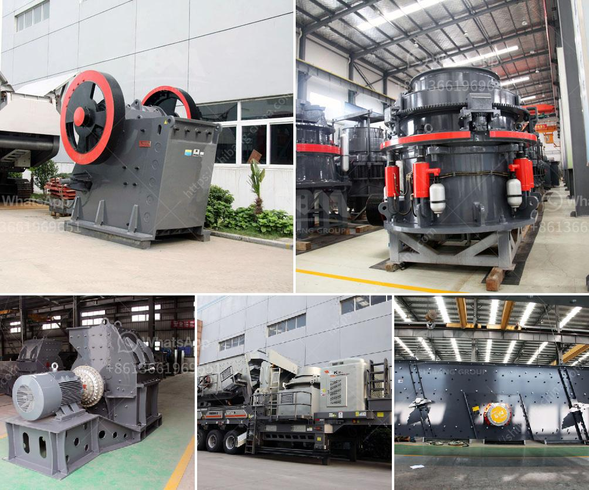

<h3>black stone crushing thailand</h3>
Black stone crushing in Thailand is a common phenomenon where countless makeshift stalls and workstations are scattered across the country, producing an endless quantity of quarry stones. Unbeknownst to many, these stones are dug up and transported to the cities, where they are used in construction projects, industrial production, and even as materials for decorative landscaping.

The process of black stone crushing begins with the extraction of large rocks from the earth's surface, usually in quarries or open-pit mines. These rocks are then transported to the crushing site, where they are broken down into smaller, more manageable sizes using a range of specialized equipment. The stones are crushed using various techniques, such as jaw crushers, impact crushers, and cone crushers, depending on the desired final product.

Due to its abundance and durability, black stone has been utilized in the construction industry for centuries. Its unique color and texture make it a popular choice for landscaping and decorative purposes as well. In Thailand, black stone has been widely used in the construction of roads, bridges, buildings, and even statues and monuments.

The booming construction industry of Thailand has led to an increase in demand for black stone, resulting in the proliferation of stone crushing businesses across the country. These businesses range from small, family-run operations to larger companies with a substantial workforce. Many of these businesses operate informally and lack proper permits and environmental regulations.

Despite their contributions to the construction industry, black stone crushing operations pose several challenges and concerns. Firstly, the lack of proper regulation and oversight often leads to disregard for environmental and health standards. The dust and debris generated during the crushing process can have serious health implications for nearby communities, including respiratory issues, eye irritation, and long-term lung diseases.

Moreover, the uncontrolled extraction of black stone can lead to land degradation and deforestation. Trees are often cleared to make way for quarrying activities, which disrupts ecosystems and contributes to soil erosion. In addition, the removal of large quantities of stones can cause land subsidence, further exacerbating environmental concerns.

Efforts to regulate and formalize black stone crushing operations in Thailand are underway. The government has recognized the need to establish guidelines and standards to ensure the safety of workers, minimize environmental impact, and protect nearby communities. However, the enforcement of these regulations remains a challenge, as many stone crushing operations continue to operate informally.

In conclusion, black stone crushing is a prevalent practice in Thailand that supports the construction industry and provides materials for various applications. However, the lack of regulation and oversight has led to environmental and health concerns. It is essential for the government to enforce proper guidelines and regulations to ensure the sustainability of this industry while protecting the environment and the well-being of communities.
<h3>Contact us</h3><ul><li><strong>Whatsapp:&nbsp;<a href="https://wa.me/8613661969651">+8613661969651</a></strong></li><li><a href="https://swt.shibang-china.com/?git&amp;zhl&amp;black stone crushing thailand"><strong>Online Service(chat now)</strong></a></li></ul><h3>Related</h3><ul><li><a href='cost of roller crusher.md'>cost of roller crusher</a></li><li><a href='stone aggregate screen in south africa.md'>stone aggregate screen in south africa</a></li><li><a href='applied geochemistry for mica processing.md'>applied geochemistry for mica processing</a></li><li><a href='crusher company in kenya.md'>crusher company in kenya</a></li><li><a href='200mm crusher sieve opening sizes.md'>200mm crusher sieve opening sizes</a></li></ul>