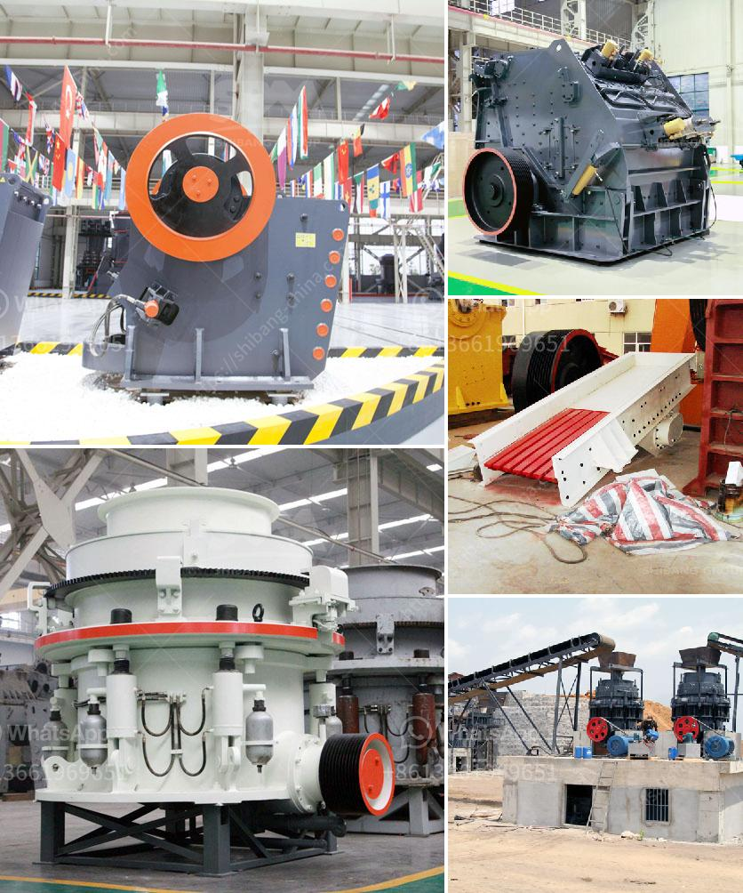

<h3>blast furnace slag grinding machine india</h3>
Blast furnace slag grinding machine India, also known as slag mill, is the most critical equipment in slag powder production line. Different from ball mill, this machine is specifically designed for high-yield, low-power consumption, and easy maintenance. The slag mill is widely used in various industries like superfine slag powder production, metallurgy, chemical industry, cement production, and more.

India, as an unmissable market for the building material industry, has maintained a high demand for slag powder. Blast furnace slag, a by-product of iron and steel industry, can be ground into micro powder to meet the requirements of high strength and durability in concrete materials. With the continued development and innovation in the field of slag grinding, the India market for blast furnace slag grinding machine has gradually expanded.

Compared with other grinding machines, blast furnace slag mill has a relatively low energy consumption of about 40-50% and a high productivity of 70-90t/h for coarse grinding and 30-40t/h for fine grinding. Its grinding efficiency is higher than Raymond mill, ball mill, and high-pressure suspension mill, and the grinding fineness can be adjusted between 80-600 mesh. With the advantages of compact structure, small footprint, low noise, and dust-free operation, the slag mill has become a popular choice for many companies in India.

The blast furnace slag grinding machine India is equipped with advanced technical electronic control system, which enables PLC control mode to achieve automatic production operation. It has proven to be reliable and has significantly reduced the intensity of labor. In addition, the slag mill adopts a centralized control system, which ensures the stability of the production line and reduces manual intervention. The centralized control system also allows for real-time monitoring of the entire production process, making it easier for operators to adjust and control various parameters.

Furthermore, the blast furnace slag grinding machine India has a variety of models, allowing customers to choose the most suitable model according to their production requirements. Large-scale production requires a model with high capacity and efficiency, while smaller-scale production can opt for a smaller model.

In recent years, there have been significant advances in the technology of blast furnace slag grinding machine India. In particular, the use of high-quality wear-resistant materials and the adoption of advanced grinding technology have greatly extended the service life of equipment components, reducing maintenance costs and improving production efficiency.

Overall, the blast furnace slag grinding machine India plays an increasingly important role in the Indian building materials market and has a bright future. With the continuous development of the Indian economy and infrastructure construction, the demand for blast furnace slag powder is expected to increase exponentially. It is recommended that companies seize this opportunity to invest in advanced, efficient, and reliable slag grinding machines to meet market demand and achieve sustainable development.
<h3>Contact us</h3><ul><li><strong>Whatsapp:&nbsp;<a href="https://wa.me/8613661969651">+8613661969651</a></strong></li><li><a href="https://swt.shibang-china.com/?git&amp;zhl&amp;blast furnace slag grinding machine india"><strong>Online Service(chat now)</strong></a></li></ul><h3>Related</h3><ul><li><a href='ghana quarry crusher.md'>ghana quarry crusher</a></li><li><a href='applied geochemistry for mica processing.md'>applied geochemistry for mica processing</a></li><li><a href='impact crusher manufacturers china.md'>impact crusher manufacturers china</a></li><li><a href='stone crusher for excavator cost.md'>stone crusher for excavator cost</a></li><li><a href='crushing plant aggregate type.md'>crushing plant aggregate type</a></li></ul>