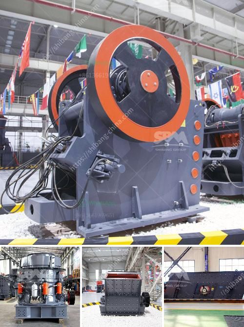

<h3>brick crushers south africa</h3>
South Africa is a country full of rich culture, history, and beautiful landscapes. As it continues to develop, the nation is embracing the concept of sustainable resource management through the use of brick crushers, a concept that has been utilized by countries around the world for decades.

Brick crushers are an essential piece of machinery in the construction and demolition industry. They can effectively break down materials such as concrete, bricks, and tiles to produce crushed aggregates or even usable sand. These machines are becoming increasingly popular due to their ability to provide sustainable solutions to the environmental and economic issues surrounding the management of construction waste.

One of the key benefits of brick crushers is their ability to recycle materials that would otherwise end up in landfills. In South Africa, construction waste accounts for a significant portion of the total waste generated, and therefore needs to be managed in an environmentally responsible manner. By crushing and reusing old bricks, concrete, and other materials, brick crushers can help to alleviate the pressure on landfills and contribute to the recycling efforts of the country.

Another advantage of utilizing brick crushers in South Africa is their affordability. Many individuals and businesses can benefit from the cost-effective recycling options that these machines offer. Instead of purchasing new materials for construction projects, brick crushers allow for the reuse of existing materials, reducing expenses and making the construction process more accessible to a wider range of people.

Moreover, the implementation of brick crushers in South Africa provides opportunities for local communities to participate in sustainable resource management. Crusher operators or businesses can be set up in various regions, creating job opportunities and stimulating economic growth. Local communities can benefit from the training, skills development, and job creation that comes with the introduction of this machinery. The establishment of brick crushers opens up a valuable space for engagement and empowerment among individuals in South Africa.

Beyond the socioeconomic benefits, brick crushers offer practical solutions for the construction industry. The recycled materials produced by these machines can be used as a substitute for conventional aggregates, reducing the demand for virgin resources and conserving natural reserves. Additionally, the crushed aggregates produced can be used for various applications, such as road construction, landscaping, and the manufacturing of new bricks and concrete products.

In conclusion, the use of brick crushers in South Africa provides a sustainable solution to the challenges associated with construction waste management. By recycling materials, reducing costs, creating job opportunities, and minimizing the demand for virgin resources, brick crushers are empowering local communities and contributing to the sustainable development of the country. As South Africa continues to prioritize environmental responsibility, the integration of these machines into construction practices proves to be an important step towards achieving a more sustainable future.
<h3>Contact us</h3><ul><li><strong>Whatsapp:&nbsp;<a href="https://wa.me/8613661969651">+8613661969651</a></strong></li><li><a href="https://swt.shibang-china.com/?git&amp;zhl&amp;brick crushers south africa"><strong>Online Service(chat now)</strong></a></li></ul><h3>Related</h3><ul><li><a href='used for sale raymond roller mills india.md'>used for sale raymond roller mills india</a></li><li><a href='uk quarry crusher machinery manufacturers.md'>uk quarry crusher machinery manufacturers</a></li><li><a href='ball mill in kazakhstan.md'>ball mill in kazakhstan</a></li><li><a href='kenya crusher supplier.md'>kenya crusher supplier</a></li><li><a href='impact crusher manufacturers china.md'>impact crusher manufacturers china</a></li></ul>