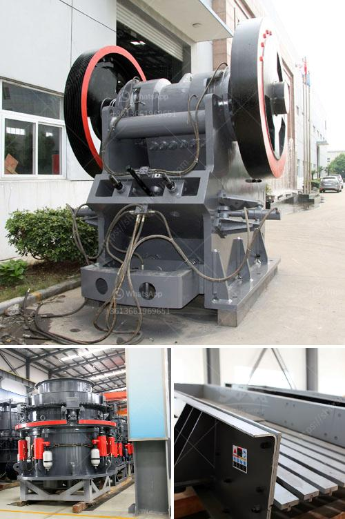

<h3>brick machine manufacturers south africa</h3>
South Africa, with its bustling and rapidly evolving construction industry, has witnessed a significant increase in the demand for bricks. To cater to this burgeoning market, brick machine manufacturers in South Africa have emerged as key players, revolutionizing the brick-making process.

Traditionally, brick making was a labor-intensive and time-consuming process that required significant manpower. However, with the advent of brick machine manufacturers, the industry has witnessed a paradigm shift. These manufacturers specialize in manufacturing and supplying various types of brick-making machines, making the brick production process more efficient, cost-effective, and sustainable.

One of the leading brick machine manufacturers in South Africa is ABC Brick Machines. ABC Brick Machines offers a wide range of machines, including manual brick-making machines, automatic brick-making machines, hydraulic brick-making machines, and mobile brick-making machines. These machines are designed to produce high-quality bricks of different shapes and sizes, catering to the diverse needs of the construction industry.

ABC Brick Machines ensures that their machines are technologically advanced and incorporate the latest innovations in brick-making technology. This enables their machines to produce bricks quickly and efficiently, reducing the overall production time and increasing productivity. Additionally, their machines are designed to be user-friendly, making them suitable for both skilled and unskilled operators. This opens up opportunities for employment in the construction sector, contributing to job creation and economic growth.

The advent of brick machine manufacturers in South Africa has also brought about environmental benefits. Earlier, brick-making processes consumed a significant amount of energy and resulted in high carbon emissions, contributing to environmental degradation. However, with the introduction of advanced brick-making machines, the process has become more sustainable. The machines are designed to use less energy and produce fewer emissions, thus reducing the carbon footprint. Furthermore, manufacturers like ABC Brick Machines prioritize the use of eco-friendly materials in their machines, ensuring sustainability throughout the production process.

Another prominent brick machine manufacturer in South Africa is Hydraform. Hydraform has gained widespread recognition for their innovative Hydraform Interlocking Blockmaking Machines. These machines utilize high-pressure hydraulic technology to produce interlocking blocks, which eliminate the need for mortar, resulting in faster and cost-efficient construction. Hydraform's machines are known for their durability, efficiency, and versatility, making them suitable for a variety of construction projects.

The presence of reputable brick machine manufacturers in South Africa has significantly transformed the construction industry. With their advanced machines and technologies, the production of bricks has become faster, more efficient, and sustainable. Moreover, these manufacturers have contributed to the development of skilled and semi-skilled employment opportunities, promoting economic growth and uplifting communities.

The rise of brick machine manufacturers in South Africa has not only revolutionized the way bricks are produced but has also positively impacted the construction industry as a whole. As the demand for bricks continues to escalate, these manufacturers play a crucial role in meeting the growing needs of the industry while contributing to the country's economic development and environmental sustainability.
<h3>Contact us</h3><ul><li><strong>Whatsapp:&nbsp;<a href="https://wa.me/8613661969651">+8613661969651</a></strong></li><li><a href="https://swt.shibang-china.com/?git&amp;zhl&amp;brick machine manufacturers south africa"><strong>Online Service(chat now)</strong></a></li></ul><h3>Related</h3><ul><li><a href='gypsum gypsum plant supplier from germany.md'>gypsum gypsum plant supplier from germany</a></li><li><a href='crusher in hialeah sale.md'>crusher in hialeah sale</a></li><li><a href='100 mt hr stone crusher machine.md'>100 mt hr stone crusher machine</a></li><li><a href='second hand jaw pulverizer india.md'>second hand jaw pulverizer india</a></li><li><a href='standard operating procedure of vibrating feeder.md'>standard operating procedure of vibrating feeder</a></li></ul>