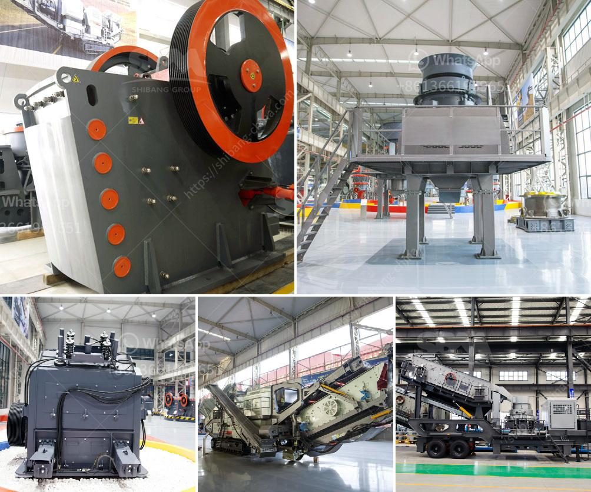

<h3>broach grinding machine manufacture in china</h3>
Broach grinding machines are used to shape and finish various types of broaches. A broach is a multi-tooth cutting tool that is used to remove material from a workpiece in a specific shape or pattern. These machines are commonly used in the automotive, aerospace, and machine tool industries.

China has emerged as a major player in the manufacturing and export of broach grinding machines. The country offers a wide variety of high-quality machines that are cost-effective and reliable. Chinese manufacturers have invested heavily in research and development to enhance the performance and efficiency of these machines.

One of the key advantages of broach grinding machines manufactured in China is their precision. These machines can achieve high levels of accuracy and repeatability, ensuring that the finished products meet the specified requirements. Chinese manufacturers use advanced technologies and high-quality components to ensure the accuracy and reliability of their machines.

In addition to precision, Chinese broach grinding machines are also known for their durability and long lifespan. Manufacturers in China pay great attention to the design and construction of these machines, using robust materials and incorporating effective cooling systems to ensure that the machines can withstand heavy use and operate at optimal performance for extended periods.

Moreover, Chinese manufacturers offer a wide range of customization options, allowing customers to choose the specifications and features that best suit their specific needs. Whether it is the size, capacity, or type of broach grinding machine, Chinese manufacturers can tailor their products to meet the unique requirements of each customer.

Furthermore, Chinese manufacturers offer competitive prices for their broach grinding machines, making them an attractive option for businesses looking to invest in these machines. The combination of high-quality machines and affordable prices has positioned China as a leading exporter of broach grinding machines in the global market.

In conclusion, broach grinding machine manufacture in China has gained significant prominence in the global market. Chinese manufacturers offer a wide range of high-quality and precision machines that are durable, customizable, and competitively priced. As the demand for broach grinding machines continues to grow, China's manufacturing industry is well-positioned to meet the needs of customers worldwide.
<h3>Contact us</h3><ul><li><strong>Whatsapp:&nbsp;<a href="https://wa.me/8613661969651">+8613661969651</a></strong></li><li><a href="https://swt.shibang-china.com/?git&amp;zhl&amp;broach grinding machine manufacture in china"><strong>Online Service(chat now)</strong></a></li></ul><h3>Related</h3><ul><li><a href='coal beneficiation process.md'>coal beneficiation process</a></li><li><a href='netherlands impact crushers.md'>netherlands impact crushers</a></li><li><a href='gold processing equipment price in ghana.md'>gold processing equipment price in ghana</a></li><li><a href='plant project report pdf stone crushing.md'>plant project report pdf stone crushing</a></li><li><a href='coal crushing machine in malaysia.md'>coal crushing machine in malaysia</a></li></ul>