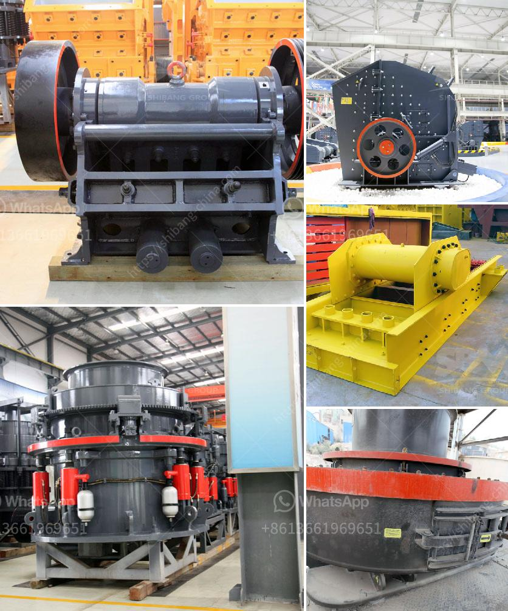

<h3>business plan for a small chrome mining company</h3>
Starting a small chrome mining company requires careful planning and a strategic approach. In this article, we will outline the key components of a comprehensive business plan for such a venture. Whether you are a seasoned entrepreneur or a new player in the mining industry, a well-structured business plan will help you navigate challenges, secure funding, and maximize the potential for success.

The executive summary should provide a concise overview of your business plan, highlighting your company's vision, objectives, and strategies. It should give potential investors or partners a clear understanding of your business model and future prospects.

In this section, you should present detailed information about your chrome mining company. Describe the nature of your operation, including the type of chrome you will extract, your target market, and competitive advantages that set you apart from other players in the industry. Highlight any relationships you have with key suppliers, customers, or strategic partners.

Conduct thorough market research to assess the demand for chrome within your target market. Identify key economic drivers, trends, and opportunities that will impact the industry. Analyze the competition, pricing strategies, and any market barriers. Understand potential threats and devise strategies to overcome them.

Detail the operations involved in mining chrome, including exploration, extraction, processing, and distribution. Discuss the required infrastructure, such as mining equipment, processing facilities, and transportation logistics. Outline the cost estimation for procuring and maintaining the equipment, as well as the necessary permits and licenses.

Develop a marketing plan to effectively reach your target customers and promote your chrome products. Identify the most suitable channels to showcase your products, such as industry trade shows, online platforms, and direct sales. Highlight your unique selling points, such as superior quality, competitive pricing, or sustainable practices.

Explain the organizational structure of your company and outline the roles and responsibilities of key personnel. Briefly introduce the management team, showcasing their expertise and relevant experience in the mining industry. Address plans for hiring additional staff as your operations expand.

Prepare detailed financial projections, including income statements, balance sheets, and cash flow statements. Estimate the revenue potential based on current and projected chrome prices, production volume, and operating costs. Factor in contingencies, such as potential price fluctuations or increased operating expenses.

Assess the potential risks associated with your chrome mining operations and develop mitigation strategies to minimize their impact. Address key factors, such as market volatility, regulatory changes, operational challenges, environmental impacts, and geopolitical risks. By demonstrating effective risk management strategies, you can instill confidence in potential investors.

Crafting a strong business plan for a small chrome mining company is pivotal to its long-term success. This comprehensive document will guide your operations, attract stakeholders, and secure funding. Remember to regularly revisit and update your business plan to reflect the evolving market dynamics and adapt to new opportunities or challenges that may arise along the way. With careful planning and strategic execution, your small chrome mining company can thrive in a competitive industry.
<h3>Contact us</h3><ul><li><strong>Whatsapp:&nbsp;<a href="https://wa.me/8613661969651">+8613661969651</a></strong></li><li><a href="https://swt.shibang-china.com/?git&amp;zhl&amp;business plan for a small chrome mining company"><strong>Online Service(chat now)</strong></a></li></ul><h3>Related</h3><ul><li><a href='ultrafine grinder for producing powder.md'>ultrafine grinder for producing powder</a></li><li><a href='stone crushing feasibility study.md'>stone crushing feasibility study</a></li><li><a href='product japan crushing plant.md'>product japan crushing plant</a></li><li><a href='strainer of crushing machine.md'>strainer of crushing machine</a></li><li><a href='marble stone sheet production line.md'>marble stone sheet production line</a></li></ul>