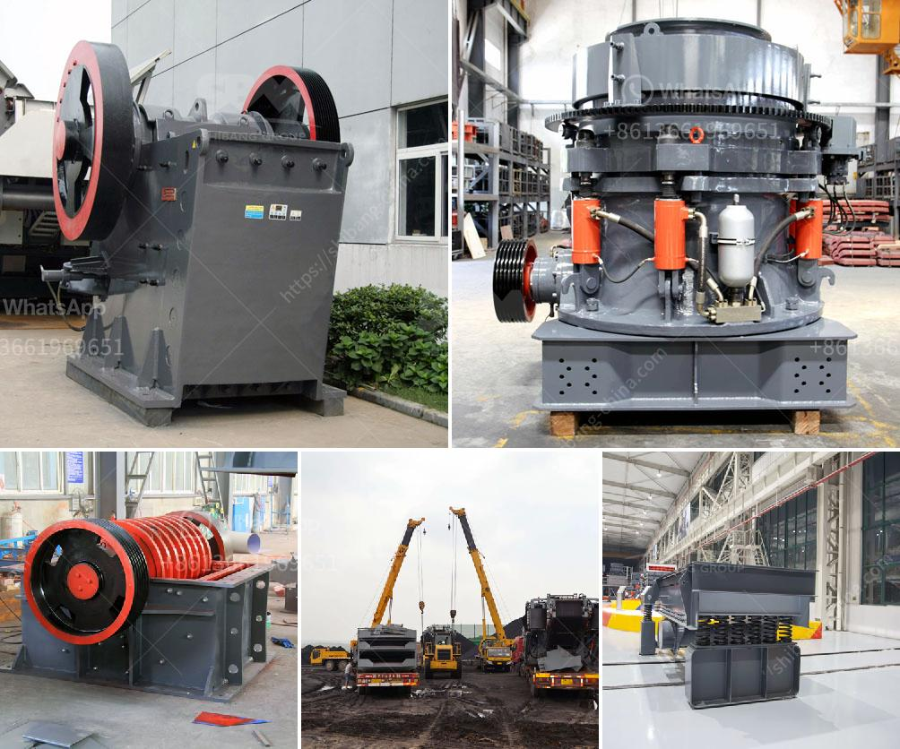

<h3>business plan for sand making machine</h3>
A business plan is essential for any entrepreneur or business owner looking to start or expand their sand making machine business. This document serves as a roadmap, outlining the goals, strategies, and financial projections for the venture. By having a well-thought-out business plan, entrepreneurs can demonstrate to potential investors or lenders their vision and how they intend to achieve success.

The first step in developing a business plan for a sand making machine business is conducting thorough market research. This includes understanding the demand for sand in the region, analyzing the competition, and identifying potential target markets. Understanding these factors will help in determining the size and scope of the business.

Next, entrepreneurs should outline their objectives and strategies. This includes determining the production capacity, pricing strategy, and marketing plan. A sand making machine business may choose to focus on certain industries, such as construction or glass manufacturing, and tailor their strategies accordingly. It is crucial to identify the unique selling points and advantages of the sand making machine in order to differentiate from competitors.

Financial projections are a crucial part of the business plan. Entrepreneurs need to estimate the startup costs, including the purchase of the sand making machine, raw materials, and labor. Additionally, ongoing expenses such as maintenance, marketing, and overhead costs must be accounted for. By projecting revenue and expenses over a specific period, entrepreneurs can determine the breakeven point and potential profitability of the business.

Lastly, a business plan should include a comprehensive risk assessment and mitigation strategy. This involves identifying potential challenges or obstacles that may arise and developing contingency plans to address them. Factors such as fluctuations in material costs, changes in regulations, or economic downturns should be considered and planned for.

In conclusion, a business plan is crucial for a sand making machine business as it serves as a roadmap for success. By conducting market research, outlining objectives and strategies, projecting financials, and addressing potential risks, entrepreneurs can confidently present their ideas to potential investors or lenders. With a well-structured business plan, entrepreneurs can increase their chances of securing funding and turning their sand making machine business into a profitable venture.
<h3>Contact us</h3><ul><li><strong>Whatsapp:&nbsp;<a href="https://wa.me/8613661969651">+8613661969651</a></strong></li><li><a href="https://swt.shibang-china.com/?git&amp;zhl&amp;business plan for sand making machine"><strong>Online Service(chat now)</strong></a></li></ul><h3>Related</h3><ul><li><a href='gold mining used jaw crusher.md'>gold mining used jaw crusher</a></li><li><a href='crushers plant cost.md'>crushers plant cost</a></li><li><a href='stone crusher cost.md'>stone crusher cost</a></li><li><a href='limestone processing in nigeria.md'>limestone processing in nigeria</a></li><li><a href='silica sand production line in german.md'>silica sand production line in german</a></li></ul>