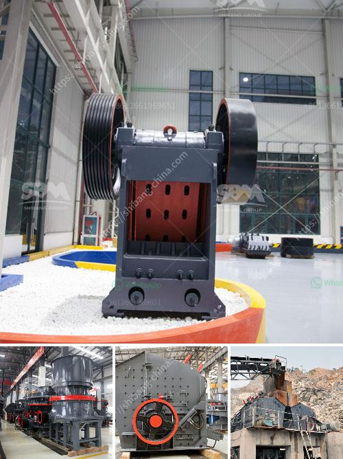

<h3>business plan for small scale chrome mining</h3>
Small-scale chrome mining is an exciting venture that promises substantial growth potential for entrepreneurs looking to venture into the mining industry. Chrome mining plays a vital role in various industries, including the manufacturing of stainless steel, pigment production, refractory bricks, and chemical production. However, a well-thought-out business plan is crucial to navigate the intricate web of challenges that this industry poses. This article dives into the key components of a business plan for small-scale chrome mining.

The executive summary is a concise overview of your business plan, providing a clear snapshot of your goals, strategies, and financial projections. By briefly summarizing the entire plan, it allows potential investors, lenders, or partners to quickly grasp the essence of your small-scale chrome mining venture.

This section provides a detailed description of your company, its legal structure, location, management team, and mining operations. Include information about your licenses, permits, and any existing contracts or partnerships that may lend credibility to your enterprise.

Conduct thorough market analysis to demonstrate a comprehensive understanding of the chrome mining industry. Identify your target market, competition, and potential customers. Highlight the current demand for chrome and its future growth prospects to showcase the profitability of your venture.

Detail your marketing and sales strategies for attracting potential customers and creating a lucrative customer base. Discuss how you plan to promote your products, build relationships with buyers, and secure long-term agreements for chrome sales.

In this section, outline the various aspects of your chrome mining operations, including the machinery and equipment required, mining methods, and workforce. Explain how you plan to address logistical challenges, transportation of the chrome, and any storage or processing needs.

Develop a comprehensive financial projection that highlights your expected revenue, expenses, and profits over a specific period. Include a startup budget, anticipated cash flow, and a detailed profit and loss statement. Incorporate data on fixed and variable costs, prices, and anticipated production volumes to provide a well-rounded financial forecast.

Acknowledge the risks inherent to chrome mining, such as fluctuating global market prices, environmental concerns, regulatory changes, and operational challenges. Detail your strategies for managing and mitigating these risks to reassure potential investors and stakeholders about the sustainability of your business.

Recognize the importance of sustainability and corporate social responsibility (CSR) in the mining industry. Outline your CSR initiatives to support the local community, protect the environment, and promote responsible mining practices. This demonstrates your commitment to ethical and sustainable operations, which can enhance your reputation and attract socially conscious investors.

Crafting a well-rounded business plan for small-scale chrome mining is an essential step in securing financing, attracting partners, and guiding your operations. It requires a comprehensive market analysis, thorough financial projections, and a clear roadmap to navigate the challenges of the industry. By addressing the various components discussed above, you can position your venture as a profitable and sustainable player in the chrome mining sector.
<h3>Contact us</h3><ul><li><strong>Whatsapp:&nbsp;<a href="https://wa.me/8613661969651">+8613661969651</a></strong></li><li><a href="https://swt.shibang-china.com/?git&amp;zhl&amp;business plan for small scale chrome mining"><strong>Online Service(chat now)</strong></a></li></ul><h3>Related</h3><ul><li><a href='dolomite powder machine in sri lanka.md'>dolomite powder machine in sri lanka</a></li><li><a href='crushing and screening plant supplier china.md'>crushing and screening plant supplier china</a></li><li><a href='crusher plant project report pdf.md'>crusher plant project report pdf</a></li><li><a href='dolomite lime manufacturers in ghana.md'>dolomite lime manufacturers in ghana</a></li><li><a href='beneficiation of iron ore in dry methods.md'>beneficiation of iron ore in dry methods</a></li></ul>