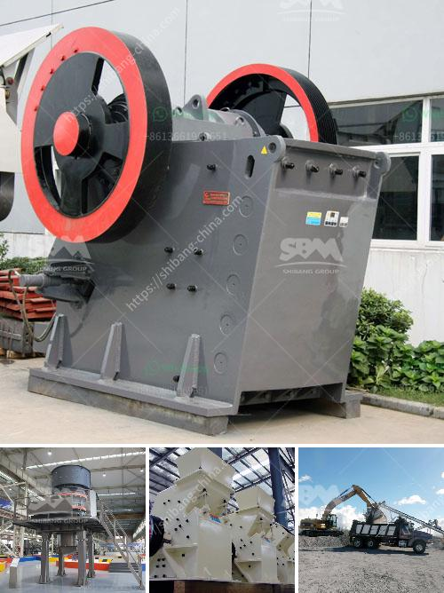

<h3>business proposal sample for mobile crusher</h3>
A mobile crusher is a crucial investment for any construction or mining company. This is especially true when you are running a business on a tight budget. In order to get the most bang for your buck, you will need a business proposal sample for mobile crusher that clearly outlines the benefits and costs associated with this investment.

The use of mobile crushers in the mining and construction industry has been on the rise in recent years. This is due to their ability to crush materials on-site, which eliminates the need for transportation costs. Additionally, mobile crushers are versatile machines that can be used in various applications such as crushing rock, concrete, and asphalt.

- Cost reduction: By investing in a mobile crusher, you can save on transportation costs. Instead of hauling materials from the quarry to the construction site, you can crush them directly on-site. This not only saves time but also reduces fuel consumption and wear on the roads.

- Increased productivity: With a mobile crusher, you can process materials faster and more efficiently. This means that you can complete projects in a shorter amount of time, increasing overall productivity.

- Flexibility: Mobile crushers can be easily moved from one location to another, depending on the needs of your project. This flexibility allows you to quickly adapt to changing requirements and maximize the use of your equipment.

- Environmental friendliness: Using a mobile crusher reduces the environmental impact of your operations. The crusher can be equipped with a dust suppression system, which minimizes the release of dust and other harmful particles into the air. Additionally, the use of mobile crushers reduces the need for traditional crushing plants, which are often more energy-intensive.

- Initial investment: The cost of a mobile crusher can vary depending on its features, capacity, and manufacturer. It's important to carefully evaluate your needs and budget before making a purchase.

- Maintenance: Regular maintenance is essential to ensure the longevity and efficiency of your mobile crusher. This includes routine inspections, lubrication, and replacement of worn-out parts. It's important to factor in these costs when preparing your budget.

- Operator training: Operating a mobile crusher requires specialized skills and training. It's important to invest in training programs to ensure that your operators can safely and efficiently operate the machine.

Investing in a mobile crusher can have significant benefits for your business. By reducing transportation costs, increasing productivity, and providing flexibility, a mobile crusher can greatly improve the efficiency of your operations. However, it's important to carefully evaluate the costs and benefits before making a decision. By using this business proposal sample for mobile crusher, you can clearly outline the advantages and potential drawbacks of this investment, helping you make an informed decision for your business.
<h3>Contact us</h3><ul><li><strong>Whatsapp:&nbsp;<a href="https://wa.me/8613661969651">+8613661969651</a></strong></li><li><a href="https://swt.shibang-china.com/?git&amp;zhl&amp;business proposal sample for mobile crusher"><strong>Online Service(chat now)</strong></a></li></ul><h3>Related</h3><ul><li><a href='raymond used mill for sale.md'>raymond used mill for sale</a></li><li><a href='crusher company in kenya.md'>crusher company in kenya</a></li><li><a href='impact crusher zenith.md'>impact crusher zenith</a></li><li><a href='price list of granite crusher.md'>price list of granite crusher</a></li><li><a href='design for stone crusher plant.md'>design for stone crusher plant</a></li></ul>