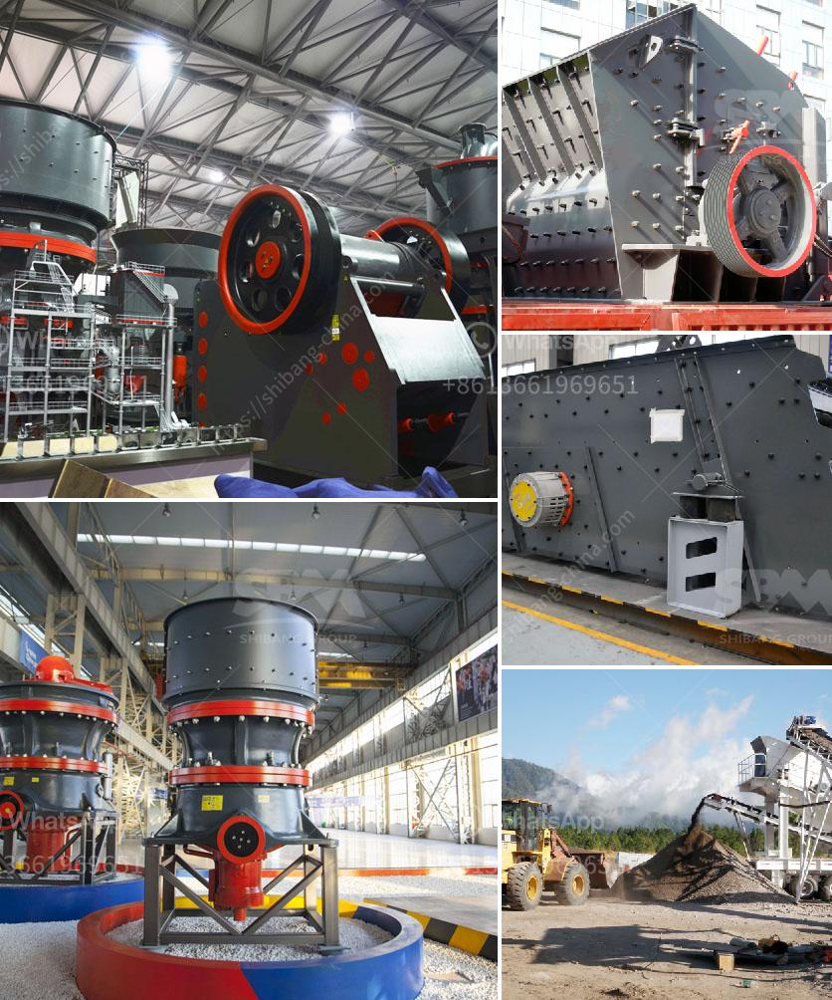

<h3>buy mobile crusher in usa</h3>
Mobile crushers are becoming increasingly popular in the United States, and for good reason. They offer numerous benefits for various industries, helping to improve efficiency and productivity. Whether you are in the construction, mining, or recycling industry, a mobile crusher can provide you with the flexibility and convenience you need to get the job done.

One of the main advantages of a mobile crusher is its portability. Unlike traditional crushers, which are fixed in one place, mobile crushers can be easily transported from one location to another. This means that you can bring the crusher directly to the site where the materials are, eliminating the need for costly transportation and saving you time and money.

Another benefit of a mobile crusher is its ability to handle a wide range of materials. Whether you need to crush rocks, concrete, or asphalt, a mobile crusher can handle it all. This versatility allows you to tackle different projects without having to invest in multiple machines. It also ensures that you can process materials on-site, reducing the need for additional equipment and minimizing waste.

In addition to these advantages, mobile crushers also offer excellent performance. They are designed to efficiently crush materials, providing you with high-quality end products. Whether you require fine aggregates for construction or crushed materials for recycling, a mobile crusher can deliver the desired output. Some models even offer adjustable settings, allowing you to customize the particle size to meet your specific needs.

When it comes to purchasing a mobile crusher in the USA, there are a few factors to consider. First and foremost, you should choose a reputable supplier. Look for a company that has a proven track record and positive customer reviews. This will ensure that you are buying a high-quality machine that will serve you well for years to come.

You should also consider the specific requirements of your industry and choose a mobile crusher that meets those needs. For example, if you work in construction, you may need a crusher with a high throughput capacity to handle large volumes of materials. On the other hand, if you are in the recycling industry, you may be more concerned about the crusher's ability to process different types of waste materials.

Budget is also an important consideration when purchasing a mobile crusher. Set a budget and look for options that fall within that range. Remember, however, that quality should not be compromised for price. It is better to invest in a reliable and efficient machine, even if it means stretching your budget slightly.

In conclusion, mobile crushers are a valuable tool for various industries in the USA. Their portability, versatility, and performance make them an excellent choice for crushing materials on-site. If you are in need of a mobile crusher, ensure that you choose a reputable supplier and consider your industry-specific requirements. By doing so, you can enjoy the benefits of improved efficiency, productivity, and cost savings.
<h3>Contact us</h3><ul><li><strong>Whatsapp:&nbsp;<a href="https://wa.me/8613661969651">+8613661969651</a></strong></li><li><a href="https://swt.shibang-china.com/?git&amp;zhl&amp;buy mobile crusher in usa"><strong>Online Service(chat now)</strong></a></li></ul><h3>Related</h3><ul><li><a href='recycled glass price per tonne in durban.md'>recycled glass price per tonne in durban</a></li><li><a href='small grinding machine for limestone.md'>small grinding machine for limestone</a></li><li><a href='crushing machine malaysia.md'>crushing machine malaysia</a></li><li><a href='rental of crusher in malaysia.md'>rental of crusher in malaysia</a></li><li><a href='mobile gold processing 20 tph.md'>mobile gold processing 20 tph</a></li></ul>