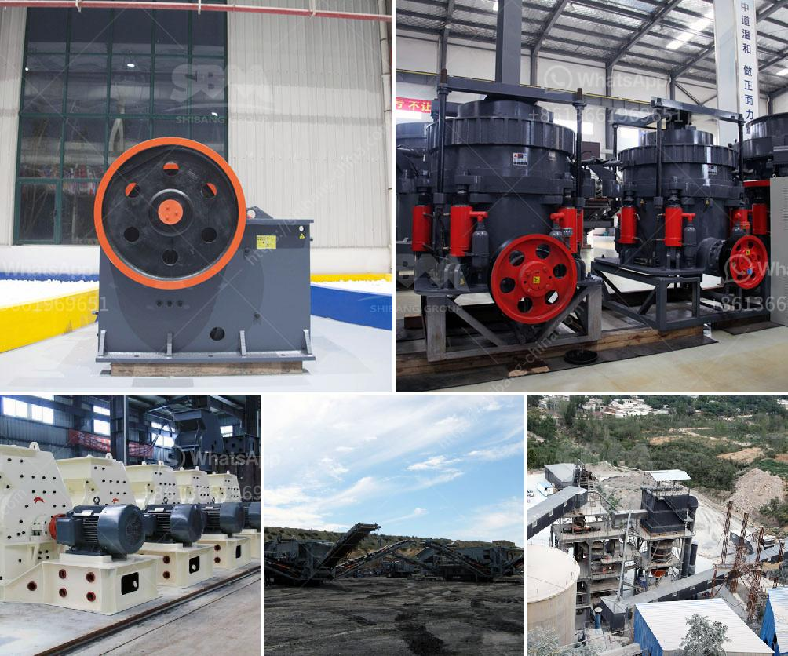

<h3>caco3 manufacturing process</h3>
Calcium carbonate, commonly known as CaCO3, is one of the most widely used raw materials in various industries. It is primarily utilized in the manufacturing of cement, building materials, paper, plastics, paints, and coatings. This article will delve into the manufacturing process of calcium carbonate, highlighting its importance and various applications.

Calcium carbonate is predominantly found in nature in the form of limestone, marble, or chalk. It is extracted through mining or quarrying these natural deposits. Once the limestone is unearthed, it is crushed into smaller fragments and transported to the processing plant. The mineral undergoes a series of steps to obtain the desired calcium carbonate product.

The first step in the manufacturing process involves the pre-treatment of the limestone. The large chunks of limestone are fed into a primary crusher to reduce their size. The crushed limestone is then conveyed to a secondary crusher for further size reduction. After crushing, the limestone is fed into a mill, where it is ground into a fine powder. This fine powder is referred to as raw material.

The raw material is now ready for the next stage of the manufacturing process, which is known as calcination. Calcination involves heating the raw material at a high temperature to remove impurities and moisture. This process transforms the raw material into a product known as quicklime or calcium oxide (CaO). The calcination is typically carried out in a kiln, where the limestone powder is exposed to temperatures ranging from 900 to 1000 degrees Celsius. As a result of this heat treatment, carbon dioxide (CO2) is released, leaving behind calcium oxide.

The next step in the process is hydration, which is essential for the conversion of calcium oxide into calcium hydroxide [Ca(OH)2]. The quicklime is mixed with water in a process commonly known as slaking. This chemical reaction produces a thick paste, commonly referred to as lime slurry or milk of lime. Calcium hydroxide is a versatile compound used in various applications such as water treatment, flue gas desulfurization, and the manufacturing of paper and textiles.

Finally, the calcium hydroxide undergoes a process called carbonation. Carbonation involves exposing the calcium hydroxide to carbon dioxide. This chemical reaction produces calcium carbonate, which can be precipitated or left in suspension in water. The precipitated calcium carbonate (PCC) is then filtered, dried, and ground into different particle sizes, depending on the intended application. On the other hand, the suspended calcium carbonate can be utilized in applications such as adhesives and sealants.

The manufacturing process of calcium carbonate not only requires the extraction and processing of raw materials but also involves various chemical reactions and technological advancements. It is a highly controlled and efficient process, ensuring the production of high-quality calcium carbonate products that meet the demands of different industries.

In conclusion, calcium carbonate is a versatile and essential compound that finds extensive usage across various industries. Its manufacturing process starts with the extraction and crushing of limestone, followed by grinding, calcination, hydration, and carbonation. This results in the production of different calcium carbonate products that cater to diverse applications. The process ensures the efficient utilization of resources while maintaining the quality and performance of the final products.
<h3>Contact us</h3><ul><li><strong>Whatsapp:&nbsp;<a href="https://wa.me/8613661969651">+8613661969651</a></strong></li><li><a href="https://swt.shibang-china.com/?git&amp;zhl&amp;caco3 manufacturing process"><strong>Online Service(chat now)</strong></a></li></ul><h3>Related</h3><ul><li><a href='cone crusher plant for sale.md'>cone crusher plant for sale</a></li><li><a href='cement lime crusher.md'>cement lime crusher</a></li><li><a href='mobile quarry crushing plant price in jamaica.md'>mobile quarry crushing plant price in jamaica</a></li><li><a href='grinding media balls turkey.md'>grinding media balls turkey</a></li><li><a href='bentonite milling plant.md'>bentonite milling plant</a></li></ul>