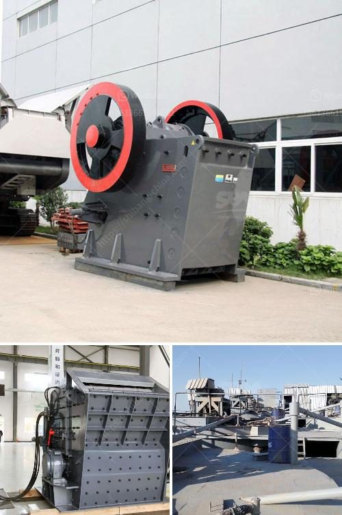

<h3>calcite crushing equipment</h3>
Calcite, also known as calcium carbonate, is a widely used mineral in many industries. It is an abundant and important mineral resource with various uses, including construction materials, industrial raw materials, and pharmaceutical applications. To efficiently process calcite materials into crushed stone or powder, it is crucial to have an efficient crushing equipment system.

Calcite crushers can be divided into two main types: primary crushers and secondary crushers. Primary crushers are used in the initial stage of calcite processing. They can crush large size calcite stones into smaller particles with higher capacity. For this reason, primary crushers are commonly used in large-scale calcite crushing plants.

One of the most popular primary crushers is the jaw crusher. It is an ideal choice for primary crushing because of its high crushing ratio, even particle size distribution, low operating costs, and reliable operation. Jaw crushers are widely used in various industries, including mining, metallurgy, building materials, transportation, ceramics, chemicals, agriculture, and more.

Another type of primary crusher suitable for calcite crushing is the impact crusher. This crusher utilizes impact energy to break calcite stones, rather than pressure. It is commonly used for secondary or tertiary crushing to produce smaller sizes of calcite particles. Impact crushers are known for their high reduction ratio, efficiency, and low operating costs.

In addition to the primary crushers, there are also secondary crushers in calcite processing plants. Secondary crushers are used to further reduce the size of calcite particles after primary crushing. Cone crushers are commonly used as secondary crushers due to their high efficiency, uniform particle size, and good shape of the end product. They are widely used in the mining industry and have gained popularity in the calcite crushing process.

Apart from jaw crushers, impact crushers, and cone crushers, there are also other types of crushing equipment for calcite processing. For instance, hammer crushers are often used as a finishing crusher in calcite crushing plants. As their name implies, hammer crushers use high-speed impact forces to break calcite stones.

Additionally, vertical shaft impact crushers (VSI crushers) provide a cost-effective solution for calcite crushing. VSI crushers use a high-speed rotor and anvils for impact crushing, providing a high reduction ratio and excellent particle shape.

In conclusion, efficient crushing equipment is critical for processing calcite materials into crushed stone or powder. Primary crushers like jaw crushers and impact crushers are commonly used for larger particles, while secondary crushers like cone crushers and hammer crushers are suitable for smaller particles. Additionally, vertical shaft impact crushers (VSI crushers) are effective options for achieving high reduction ratios and excellent particle shapes. Selecting the right crusher type and size is crucial for maximizing productivity and minimizing operating costs in the calcite crushing process.
<h3>Contact us</h3><ul><li><strong>Whatsapp:&nbsp;<a href="https://wa.me/8613661969651">+8613661969651</a></strong></li><li><a href="https://swt.shibang-china.com/?git&amp;zhl&amp;calcite crushing equipment"><strong>Online Service(chat now)</strong></a></li></ul><h3>Related</h3><ul><li><a href='brick crushers south africa.md'>brick crushers south africa</a></li><li><a href='ultrafiner grinding mill.md'>ultrafiner grinding mill</a></li><li><a href='hammer mills for sale in zimbabwe.md'>hammer mills for sale in zimbabwe</a></li><li><a href='rotary kiln design calculations.md'>rotary kiln design calculations</a></li><li><a href='nigeria crusher plant 200 tph.md'>nigeria crusher plant 200 tph</a></li></ul>