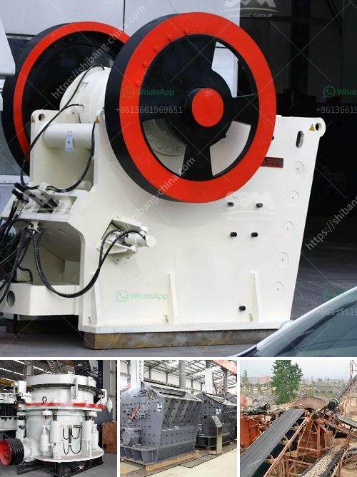

<h3>calcite powder making machine in india</h3>
Calcite powder is commonly used in industries such as paint, rubber, plastics, and ceramic. This mineral has many uses and has been used for thousands of years by the ancient Egyptians and Greeks. India has long been known for its high-quality calcite deposits and has one of the largest reserves of this mineral in the world. The mining and manufacturing of calcite powder is abundant in the country, making India the ideal place for the production of calcite powder making machines.

Calcite powder making machines in India are essential for the processing of calcite powder. Some of the popular machines used for processing calcite powder include Raymond mill, ultrafine powder mill, ball mill, hammer mill, gyratory crusher, etc. These machines have a wide range of applications in different industries and offer efficient and reliable performance.

One of the most popular calcite powder making machines in India is the Raymond mill. This machine is specifically designed for calcite processing, making it a perfect choice for processing this mineral. The Raymond mill has a series of advantages, such as strong production capacity, low energy consumption, and small footprint. It is widely used in the grinding and processing of mineral materials in the fields of metallurgy, building materials, chemical engineering, and mining.

Another popular calcite powder making machine in India is the ultrafine powder mill. This mill is used for grinding calcite, limestone, marble, talc, and other non-metallic mineral materials. It provides high-quality ultrafine powder for various industries such as paint, plastic, rubber, papermaking, and cosmetics. The ultrafine powder mill has the advantages of high efficiency, low energy consumption, and wide application range.

Ball mill is another widely used calcite powder making machine in India. It is mainly used for grinding calcite and other materials. The ball mill has high grinding efficiency, low energy consumption, and large processing capacity. It can grind calcite into fine and superfine powder with different fineness requirements.

Hammer mill is also commonly used in India for calcite powder making. It has high production capacity, low energy consumption, and low maintenance cost. The hammer mill is suitable for processing medium-hardness and brittle materials such as calcite, limestone, coal, and cement clinker. It provides a convenient and efficient solution for calcite powder processing.

In conclusion, India is an ideal place for the production of calcite powder making machines due to its abundant calcite reserves. Various machines such as Raymond mill, ultrafine powder mill, ball mill, and hammer mill are widely used in calcite powder processing. These machines provide efficient and reliable performance, making them essential for calcite powder manufacturing in India. With the continuous development of technology, more advanced and efficient calcite powder making machines will surely emerge, contributing to the development of various industries in India.
<h3>Contact us</h3><ul><li><strong>Whatsapp:&nbsp;<a href="https://wa.me/8613661969651">+8613661969651</a></strong></li><li><a href="https://swt.shibang-china.com/?git&amp;zhl&amp;calcite powder making machine in india"><strong>Online Service(chat now)</strong></a></li></ul><h3>Related</h3><ul><li><a href='how to build a hammer mill.md'>how to build a hammer mill</a></li><li><a href='cement plant layout pdf.md'>cement plant layout pdf</a></li><li><a href='price of grinding powder manufacturing machine.md'>price of grinding powder manufacturing machine</a></li><li><a href='used crushers for sale nigeria.md'>used crushers for sale nigeria</a></li><li><a href='iron processing plant.md'>iron processing plant</a></li></ul>