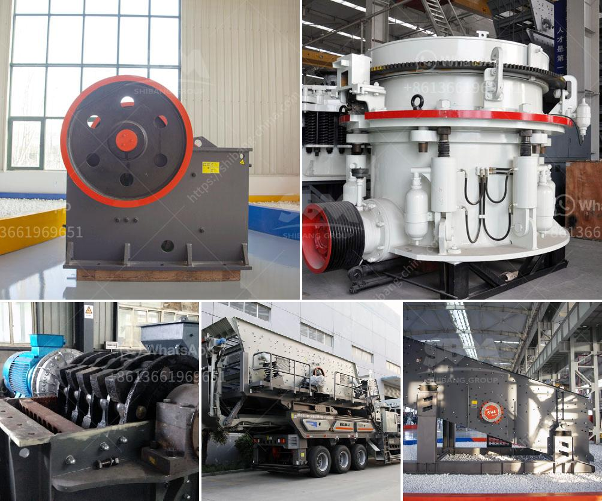

<h3>calcium carbonate plant manufacturers</h3>
When it comes to the industrial manufacturing of calcium carbonate, plant manufacturers play a crucial role. These plants are responsible for the production of high-quality calcium carbonate, a mineral compound used in various industries, including paper, plastics, rubber, and paint.

The demand for calcium carbonate has been steadily rising due to its versatility and extensive applications. With the growth in these industries, the need for reliable calcium carbonate plant manufacturers has become paramount. These manufacturers are responsible for designing, engineering, and fabricating plants that can efficiently produce calcium carbonate in large quantities while maintaining strict quality standards.

One essential factor to consider when choosing a calcium carbonate plant manufacturer is their expertise and experience. With the industry's complex nature and diverse applications, manufacturers with a proven track record can provide innovative and efficient solutions. They possess in-depth knowledge of the manufacturing processes, equipment, and systems required to produce high-quality calcium carbonate.

Advanced technologies and equipment play a significant role in the production process. Reputable calcium carbonate plant manufacturers leverage the latest technologies to ensure maximum efficiency, cost-effectiveness, and environmental sustainability. They incorporate automation and process control systems to optimize production, minimize energy consumption, and reduce waste generation.

Another crucial aspect to consider is the quality assurance measures implemented by the manufacturer. A reliable manufacturer takes quality seriously and adheres to strict quality control procedures throughout the production process. They conduct rigorous tests to ensure that the calcium carbonate produced meets the required specifications and is free from impurities.

Moreover, manufacturers should provide comprehensive customer support and after-sales services. This includes assisting in plant installation, commissioning, and training the client's staff on operating and maintaining the equipment. Timely and efficient support is vital to ensuring smooth operations and minimizing downtime.

Furthermore, it is essential to assess the manufacturer's commitment to sustainability. As the world becomes more conscious of environmental impact, responsible manufacturers employ eco-friendly production processes. They aim to reduce carbon emissions, minimize waste generation, and promote sustainable resource management.

When choosing a calcium carbonate plant manufacturer, it is advisable to evaluate their reputation in the industry. Reading customer reviews, assessing their portfolio, and studying their past projects can provide valuable insights into their capabilities and reliability. Additionally, seeking recommendations from industry experts and peers can help to make an informed decision.

In conclusion, calcium carbonate plant manufacturers play a vital role in meeting the growing demand for this mineral compound. It is crucial to choose a reliable and experienced manufacturer that employs advanced technologies, implements strict quality assurance measures, and provides comprehensive customer support. By considering these factors, industries can ensure a steady supply of high-quality calcium carbonate necessary for their processes.
<h3>Contact us</h3><ul><li><strong>Whatsapp:&nbsp;<a href="https://wa.me/8613661969651">+8613661969651</a></strong></li><li><a href="https://swt.shibang-china.com/?git&amp;zhl&amp;calcium carbonate plant manufacturers"><strong>Online Service(chat now)</strong></a></li></ul><h3>Related</h3><ul><li><a href='ballast crusher machine price.md'>ballast crusher machine price</a></li><li><a href='used mobile jaw crusher dealers in ghana.md'>used mobile jaw crusher dealers in ghana</a></li><li><a href='kenya mobile crusher.md'>kenya mobile crusher</a></li><li><a href='cost of roller crusher.md'>cost of roller crusher</a></li><li><a href='limestone processing machine.md'>limestone processing machine</a></li></ul>