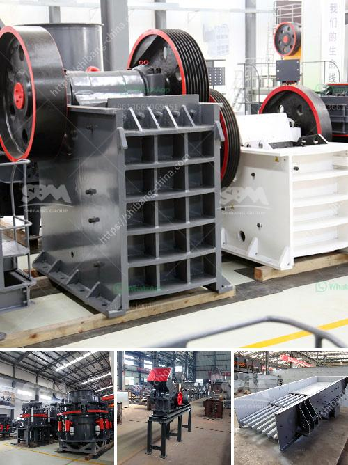

<h3>calcium carbonate processing</h3>
Calcium carbonate, commonly known as limestone, is a naturally occurring mineral found in sedimentary rocks. It is composed of calcium and carbonate ions and has a variety of uses in many industries. The processing of calcium carbonate involves crushing and grinding to obtain fine and ultra-fine powders, and then classifying the particles to achieve the desired particle size distribution.

The first step in the processing of calcium carbonate is crushing, where the limestone is crushed into small pieces. This is typically done using a jaw crusher or gyratory crusher. Once crushed, the material goes through a series of screens to separate the different particle sizes. The smaller particles are then sent to a grinding mill, where they are ground into a fine powder.

Grinding the calcium carbonate is usually done with dry mills. This can be a simple ball mill or a more complex system with an air classifier. The classification process determines the particle size distribution of the final product. Different applications require different particle sizes, so it is important to achieve the desired specifications.

The final step in the calcium carbonate processing is packaging and storage. The powder is typically stored in big bags or bulk containers and transported for further use. Calcium carbonate is widely used in various industries, such as construction, agriculture, and pharmaceuticals. It provides essential nutrients for plants, acts as a filler in building materials, and is used as a dietary supplement.

Overall, the processing of calcium carbonate involves crushing, grinding, and classifying the particles to achieve the desired particle size distribution. This versatile mineral has a wide range of applications and plays a crucial role in various industries. Whether it's providing nutrients to plants or being used as a filler in construction materials, calcium carbonate continues to be an essential mineral in our daily lives.
<h3>Contact us</h3><ul><li><strong>Whatsapp:&nbsp;<a href="https://wa.me/8613661969651">+8613661969651</a></strong></li><li><a href="https://swt.shibang-china.com/?git&amp;zhl&amp;calcium carbonate processing"><strong>Online Service(chat now)</strong></a></li></ul><h3>Related</h3><ul><li><a href='jaw crusher agen surabaya.md'>jaw crusher agen surabaya</a></li><li><a href='malaysia coconut grinder machine.md'>malaysia coconut grinder machine</a></li><li><a href='simple stone crusher dubai.md'>simple stone crusher dubai</a></li><li><a href='industrial ball mill for sale.md'>industrial ball mill for sale</a></li><li><a href='crusher dealers in kenya.md'>crusher dealers in kenya</a></li></ul>