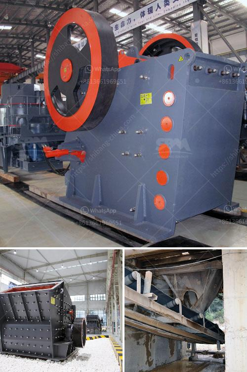

<h3>calcium carbonate production line in germany</h3>
Calcium carbonate (CaCO3) is an inorganic compound that is commonly found in limestone, calcite, marble, and chalk. It is one of the most widely used substances known to mankind and has a wide range of applications in various industries, including construction, agriculture, pharmaceuticals, and more. Germany is one of the world's largest producers of calcium carbonate, accounting for a significant portion of its global production.

The production of calcium carbonate in Germany began in the early 19th century, and it has since grown exponentially within the country's borders. Today, Germany produces a vast amount of calcium carbonate, making it one of the leading producers in the world. The country's calcium carbonate production mainly occurs in Bavaria, Thuringia, and Saxony-Anhalt, with further production sites located throughout the region.

The calcium carbonate production in Germany operates on a large scale, employing advanced technology and machinery to provide high-quality products for a wide range of applications. The production consists of several stages, from extraction of raw materials to final product packaging and delivery.

The process starts with the extraction of limestone, which is then crushed and screened to a suitable size for further processing. The crushed limestone is fed into a ball mill, where it undergoes grinding to reduce the particle size and enable its incorporation into a matrix. The materials are then mixed together to form a homogeneous mixture.

The next step in the production line is the carbon dioxide (CO2) reaction with the calcium hydroxide (Ca(OH)2), resulting in a precipitation of calcium carbonate. This reaction takes place in a specially designed reactor, where the CO2 gas is injected into the mixture. The precipitated calcium carbonate is then separated from the mixture and subjected to various treatments to enhance its purity and particle size.

The purified calcium carbonate is then dried and classified into different grades based on its particle size and purity. These grades are tailored to meet specific customer requirements and applications. For example, fine-grade calcium carbonate is used in the production of paper, while coarse-grade calcium carbonate is suitable for construction materials such as cement and asphalt.

The final step in the production line involves packaging and transportation of the calcium carbonate products. The products are packed in different forms, including bags, containers, or bulk shipments, depending on the customer's needs. Germany's well-developed transportation infrastructure ensures smooth and efficient delivery of the calcium carbonate products to both domestic and international markets.

In conclusion, Germany's calcium carbonate production line is a complex process that requires advanced technology and machinery to ensure high-quality products. The country's extensive knowledge and experience in calcium carbonate production have made it one of the leading producers in the world. With its advanced production techniques, Germany continues to contribute significantly to meeting the global demand for calcium carbonate in various industries.
<h3>Contact us</h3><ul><li><strong>Whatsapp:&nbsp;<a href="https://wa.me/8613661969651">+8613661969651</a></strong></li><li><a href="https://swt.shibang-china.com/?git&amp;zhl&amp;calcium carbonate production line in germany"><strong>Online Service(chat now)</strong></a></li></ul><h3>Related</h3><ul><li><a href='crusher for quartz.md'>crusher for quartz</a></li><li><a href='malaysia coconut grinder machine.md'>malaysia coconut grinder machine</a></li><li><a href='manufacturers hammer mill manufacturers in malaysia.md'>manufacturers hammer mill manufacturers in malaysia</a></li><li><a href='costs of conveyor belts.md'>costs of conveyor belts</a></li><li><a href='crusher machine in malaysia.md'>crusher machine in malaysia</a></li></ul>