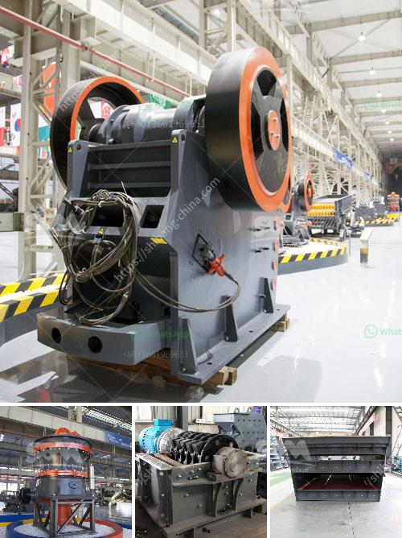

<h3>calculation of a cost of a crusher</h3>
Calculating the cost of a crusher is quite complicated due to the wide range of variables that affect the price. Factors influencing the crusher cost are numerous, including specifications, machine type, quality, processing capacity, and labor costs, among others. 

Firstly, the specifications of the crusher play a vital role in determining its cost. The size, weight, and power consumption will influence the overall price. Additionally, the specific application and required performance of the crusher will also impact its cost. For example, a jaw crusher may be more expensive than an impact crusher due to its larger size and higher capacity.

Secondly, the machine type and quality will affect the cost. There are various types of crushers available in the market, ranging from basic models to high-end machines with advanced features. Higher-quality crushers are generally more expensive due to their better performance, durability, and longer lifespan.

Moreover, the processing capacity of the crusher is a crucial factor. Crushers with higher processing capacities are typically more expensive since they require more robust components and materials. The capacity required will depend on the specific needs of the operation and the desired output size.

Lastly, labor costs are another consideration when calculating the cost of a crusher. Hiring skilled operators or maintenance personnel can add to the overall expenses. The complexity of the machine and the required expertise will determine the labor cost associated with the crusher.

To summarize, calculating the cost of a crusher involves considering various factors, including specifications, machine type, quality, processing capacity, and labor costs. Understanding these factors and assessing individual needs is essential to determine an accurate cost estimate. It is always recommended to consult with industry experts or manufacturers to get a precise cost calculation based on specific requirements.
<h3>Contact us</h3><ul><li><strong>Whatsapp:&nbsp;<a href="https://wa.me/8613661969651">+8613661969651</a></strong></li><li><a href="https://swt.shibang-china.com/?git&amp;zhl&amp;calculation of a cost of a crusher"><strong>Online Service(chat now)</strong></a></li></ul><h3>Related</h3><ul><li><a href='gypsum powder industry basic machines.md'>gypsum powder industry basic machines</a></li><li><a href='vertical vertical grinding machine.md'>vertical vertical grinding machine</a></li><li><a href='sand screw professional apr.md'>sand screw professional apr</a></li><li><a href='roller mill dimensions.md'>roller mill dimensions</a></li><li><a href='project report for establishing stone crusher.md'>project report for establishing stone crusher</a></li></ul>