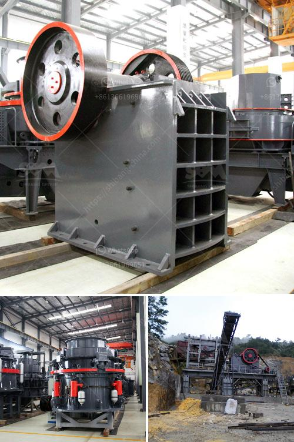

<h3>calculations on the capacity of cone crusher</h3>
Calculating the capacity of a cone crusher is a complex task that requires consideration of many factors. This intricate process is part of identifying potential issues or improvements in your operation’s cone crusher performance.

Capacity is the principle factor in determining the maximum possible throughput for a machine. Cone crushers are commonly used for secondary, tertiary, and quaternary crushing stages in comminution circuits. The main feature of cone crushers is the ability to produce a narrow-sized finished product, which results in several benefits when downstream processing is used.

In order to calculate the capacity of the cone crusher, several key parameters must be taken into account like crushing force, angle of nip, and eccentricity. The factors that affect cone crusher capacity are feed size, crushing chamber, filling level, crushing force, power, nip angle, and eccentricity.

The optimal crushing chamber shape allows the aggregate to be effectively crushed in the entire chamber, while aligning its particle size distribution with the CSS (Closed Side Setting), which directly affects the performance, quality, and overall capacity of the cone crusher. The purpose of the crushing chamber is to maximize the rock-on-rock principle, minimize the wear on the walls of the crushing chamber, and enhance the overall production performance.

Another crucial aspect is the filling level in the crushing chamber. Filling level directly impacts the capacity of the crusher, as a well-graded feed can provide optimal utilization of the crushing space. Furthermore, controlling the filling level ensures consistent product quality and stability.

Crushing force is a measure of the crusher’s ability to withstand and produce ongoing crushing forces. It is important to ensure that the crusher remains robust and can provide reliable performance under heavy loads. Excessive crushing forces can lead to overload or mechanical failure, while less crushing force can negatively affect the production capacity.

Power consumption is a major factor that affects the capacity of a cone crusher. Understanding the power consumption dynamics will lead to a more accurate calculation of the cone crusher’s capacity and power utilization.

Eccentricity is defined as the distance between the centerline of the mantle and the centerline of the main shaft. As the mantle moves, it generates a force that compresses the rock against the concave, which results in crushing. Controlling the eccentricity allows for precise adjustments to the output size, maximizing the production capacity of the cone crusher.

Determining the capacity of a cone crusher involves a combination of several factors, including the ones mentioned above. Accurate calculation of the capacity and power utilization will help you improve the performance and efficiency of your cone crusher.

In conclusion, calculating the capacity of a cone crusher is a complex process that depends on many factors. It is important to take these factors into consideration when planning and optimizing your cone crusher operation. Understanding the capacity and power utilization of a cone crusher will help you maximize your productivity while minimizing production costs.
<h3>Contact us</h3><ul><li><strong>Whatsapp:&nbsp;<a href="https://wa.me/8613661969651">+8613661969651</a></strong></li><li><a href="https://swt.shibang-china.com/?git&amp;zhl&amp;calculations on the capacity of cone crusher"><strong>Online Service(chat now)</strong></a></li></ul><h3>Related</h3><ul><li><a href='mtm trapezium mill.md'>mtm trapezium mill</a></li><li><a href='basalt impact crusher price.md'>basalt impact crusher price</a></li><li><a href='hand operated rock crusher.md'>hand operated rock crusher</a></li><li><a href='financial projections for a ore mining company.md'>financial projections for a ore mining company</a></li><li><a href='components of the nigerian mining industry.md'>components of the nigerian mining industry</a></li></ul>