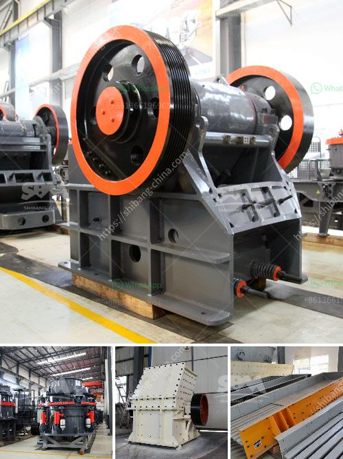

<h3>capacity of the jaw crusher</h3>
The jaw crusher is a fundamental piece of equipment for the mining industry. It is used to break down large rocks into smaller pieces, making them easier to transport and work with. However, the capacity of the jaw crusher is largely determined by the feed opening size.

The larger the feed opening, the greater the capacity. The capacity of a jaw crusher depends on the size of the feed opening, or the size of the discharge opening. This also depends on the feed size and the required product size. The hardness of the material, as well as the feed rate and wear levels, will also affect the capacity.

The jaw crusher's feed opening can accommodate larger feed size, thus significantly increasing the capacity of the machine. Crushing chamber design is optimized to increase throughput while reducing wear and tear on the crusher. The larger the feed size, the higher the reduction ratio, which means the capacity of the jaw crusher can be increased.

With careful selection and design, the jaw crusher can handle a wide range of materials, from highly abrasive rock to softer materials that can be easily crushed. This versatility is beneficial for a range of industries, including mining, construction, and demolition.

In conclusion, the capacity of a jaw crusher depends on the size and design of the feed opening. The larger the feed opening, the higher the capacity. The jaw crusher can handle a wide range of materials, including abrasive rock and softer materials, making it an important piece of equipment in any mining operation.
<h3>Contact us</h3><ul><li><strong>Whatsapp:&nbsp;<a href="https://wa.me/8613661969651">+8613661969651</a></strong></li><li><a href="https://swt.shibang-china.com/?git&amp;zhl&amp;capacity of the jaw crusher"><strong>Online Service(chat now)</strong></a></li></ul><h3>Related</h3><ul><li><a href='conveyor belt for crusher china.md'>conveyor belt for crusher china</a></li><li><a href='100 tph cone crusher price.md'>100 tph cone crusher price</a></li><li><a href='crusher jaw crusher 16x8.md'>crusher jaw crusher 16x8</a></li><li><a href='aggregate crushing plant layout.md'>aggregate crushing plant layout</a></li><li><a href='sells crushing plant in osorno.md'>sells crushing plant in osorno</a></li></ul>