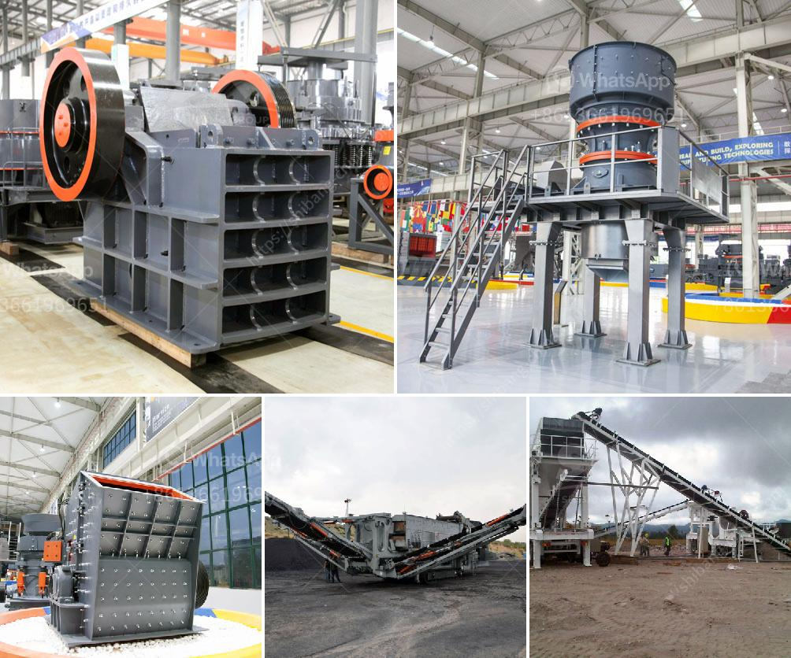

<h3>capacity screener coal tonhcapacity stone crusher</h3>
A capacity screener, also known as a coal Tonh capacity stone crusher, is an essential piece of equipment for any mining or quarrying operation. This versatile machine allows the user to screen and crush materials, making it ideal for various applications.

The primary purpose of a capacity screener is to separate different-sized materials efficiently. This is especially important in the coal industry, where coal needs to be screened and sorted based on its size for further processing. By using a capacity screener, coal operators can ensure that their products meet specific size requirements and are free from impurities.

One significant advantage of a capacity screener is its ability to handle a high volume of materials. With a tonh capacity, it can process a large amount of coal in a relatively short period, improving production efficiency. This is crucial for companies that need to meet tight deadlines and maintain a steady supply of coal to their customers.

Another advantage of the capacity screener is its versatility. It can handle a wide range of materials, including coal, stone, and other aggregates. This flexibility makes it a valuable asset for companies that operate in multiple industries, as they can use the same machine for different applications without the need for additional equipment.

Furthermore, a capacity screener is designed to be durable and reliable, even in harsh conditions. It is built to withstand heavy use and can operate continuously without experiencing significant wear and tear. This reliability ensures that the machine can work efficiently for extended periods, reducing downtime and improving overall productivity.

In conclusion, a capacity screener coal Tonh stone crusher is an essential tool for the coal industry. It allows operators to screen and crush coal efficiently, resulting in high-quality products ready for further processing. Its versatility, high capacity, and durability make it a valuable asset for mining and quarrying operations. With these benefits, companies can streamline their processes, increase productivity, and meet the demands of their customers efficiently.
<h3>Contact us</h3><ul><li><strong>Whatsapp:&nbsp;<a href="https://wa.me/8613661969651">+8613661969651</a></strong></li><li><a href="https://swt.shibang-china.com/?git&amp;zhl&amp;capacity screener coal tonhcapacity stone crusher"><strong>Online Service(chat now)</strong></a></li></ul><h3>Related</h3><ul><li><a href='100tpd slag cement plant.md'>100tpd slag cement plant</a></li><li><a href='cost of dolomite milling machine in india.md'>cost of dolomite milling machine in india</a></li><li><a href='list of stone crusher equipment.md'>list of stone crusher equipment</a></li><li><a href='gypsum grinding machine manufacturer in india.md'>gypsum grinding machine manufacturer in india</a></li><li><a href='costs of a cone crusher.md'>costs of a cone crusher</a></li></ul>