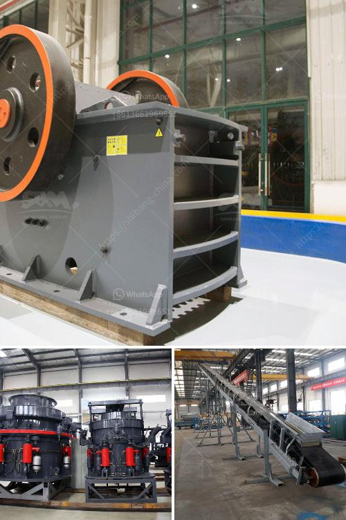

<h3>capital cost ball mill</h3>
A ball mill, a type of grinder, is a cylindrical device used in grinding (or mixing) materials like ores, chemicals, ceramic raw materials, and paints. Ball mills rotate around a horizontal axis, partially filled with the material to be ground plus the grinding medium. Different materials are used as media, including ceramic balls, flint pebbles, and stainless steel balls. An internal cascading effect reduces the material to a fine powder.

The capital cost of a ball mill is known to be a factor that influences the global occurrence of minerals. However, their studies on capital cost proved to be superficial. Furthermore, the influence of ball mill structural parameters on all processes from grinding to separation is therefore examined.

The studies on ball mill structural parameters require a lot of time and money. And, for this reason, all the researchers in the field are trying to find a cost-effective way of optimizing the structures. Luckily, there are several ways by which one can reduce the capital cost of a ball mill.

Firstly, to reduce capital costs, individual components of the ball mill must be considered. Instead of buying an entire ball mill, why not buy only the parts you need? By buying components separately, you can significantly reduce the overall cost of the mill. Additionally, this approach allows for customization, as you have the flexibility to select different components based on your specific needs.

Secondly, the type of materials used for the construction of the ball mill can also affect its capital cost. While a steel ball mill may be more expensive initially, its durability and long-term performance can outweigh the initial investment. On the other hand, a cheaper material like ceramic may be suitable for specific applications but may not be as durable or efficient in the long run.

Furthermore, a well-designed ball mill can contribute to reducing its overall capital cost. Ball mills with optimized internal dynamics minimize the power consumption of the mill and reduce wear on the grinding media, ensuring a longer lifespan. By investing in a well-designed mill, operators can save on maintenance costs and extend the life of the equipment.

Finally, the proper installation and maintenance of the ball mill can also affect its capital cost. Regular inspections, lubrication, and preventive maintenance can help identify and address potential issues early on, preventing costly repairs or replacements down the line.

In conclusion, a ball mill is an essential piece of equipment for any mining or mineral processing operation. While the initial capital cost of a ball mill may seem high, the potential long-term benefits and cost savings make it a worthwhile investment. By considering factors such as component selection, material choice, design optimization, and proper maintenance, operators can reduce the capital cost of their ball mills while maximizing their operational efficiency and profitability.
<h3>Contact us</h3><ul><li><strong>Whatsapp:&nbsp;<a href="https://wa.me/8613661969651">+8613661969651</a></strong></li><li><a href="https://swt.shibang-china.com/?git&amp;zhl&amp;capital cost ball mill"><strong>Online Service(chat now)</strong></a></li></ul><h3>Related</h3><ul><li><a href='gold mining crusher in nigeria cost.md'>gold mining crusher in nigeria cost</a></li><li><a href='aggregate wash plant for sale.md'>aggregate wash plant for sale</a></li><li><a href='stone crusher coalaries.md'>stone crusher coalaries</a></li><li><a href='mobile gold processing 20 tph.md'>mobile gold processing 20 tph</a></li><li><a href='grinding mills for ore.md'>grinding mills for ore</a></li></ul>