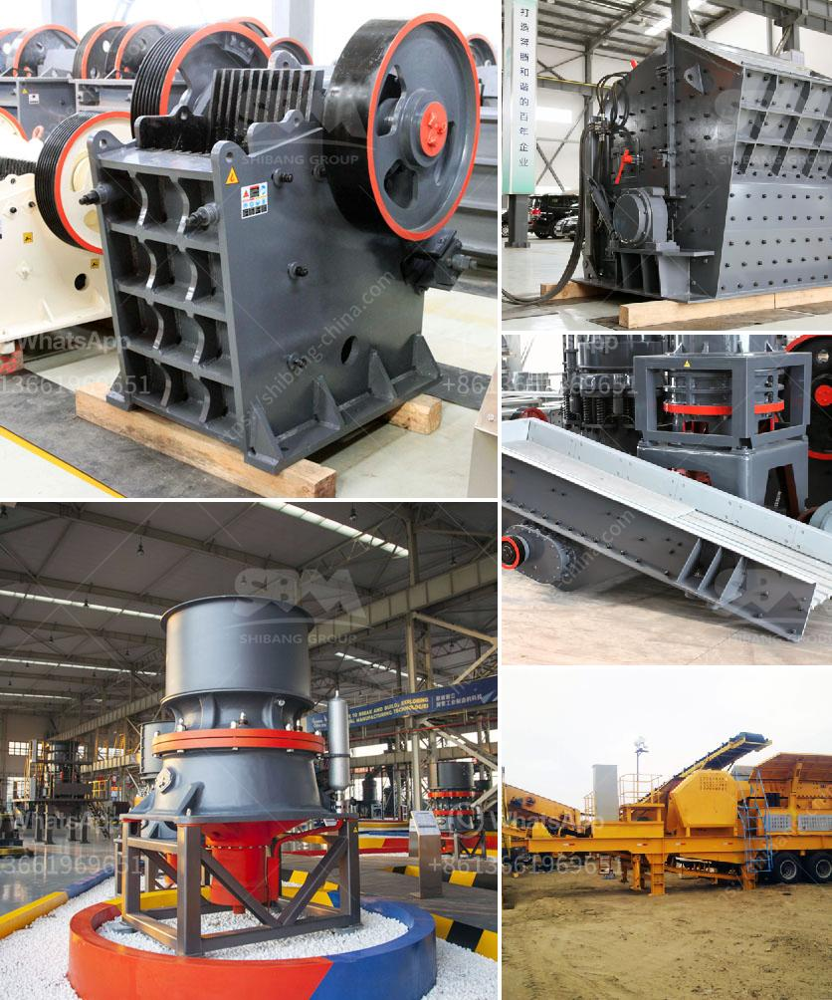

<h3>capital requirement for one ton cement mill</h3>
The cement industry is a crucial component of any country's infrastructure development. The production of cement involves the grinding of raw materials, like limestone and clay, to a fine powder and then mixing them with other additives to create a paste. This paste is then heated in a kiln to form clinker, which is eventually ground into the cement that we know and use.

One-ton cement mills play a significant role in the production process by grinding clinker into fine powder. These mills require substantial capital investment for their establishment, maintenance, and operation. In this article, we will examine the capital requirements for a typical one-ton cement mill, delving into the various areas where investments are necessary.

The primary capital requirement for setting up a cement mill is land and building acquisition. The mill requires a substantial amount of space for raw material storage, equipment installation, and other facilities. Additionally, the building should be designed to accommodate several production units smoothly. The acquisition cost of land and construction expenses could significantly impact the overall capital requirement.

One-ton cement mills consist of various machinery and equipment, including crushers, grinders, feeders, conveyors, and kilns. These machines have different purposes and form an elaborate system that enables the grinding process. The capital required to procure this machinery represents a considerable portion of the overall investment.

Cement mills are power-intensive units and necessitate an efficient electrical infrastructure. The mill requires a reliable power supply for running motors, crushers, and other equipment. Installing transformers, switchgear, and power distribution systems contribute to the capital expenses.

Environmental regulations have become increasingly stringent in the cement industry to minimize emissions and pollution. Hence, investing in pollution control systems, such as dust collectors, bag filters, and air pollution reduction technologies, is essential. This helps ensure compliance with environmental norms and maintain a sustainable manufacturing process.

A skilled and qualified workforce is vital for operating and maintaining a cement mill. From technicians to skilled personnel and engineers, every position plays a crucial role in running the mill efficiently. The capital requirement includes recruitment costs, salaries, training programs, and employee welfare measures.

The final cement product needs proper storage and packaging before it reaches the market. Bulk storage silos and packaging units, such as bags, palletizers, and loaders, are essential for this purpose. Allocating capital for these units is important to maintain product quality and meet market demands.

Setting aside a contingency fund is a prudent financial decision. Unexpected repairs, maintenance, or operational issues could arise during the mill's lifespan. Having capital reserves ensures business continuity and minimizes downtime in case of emergencies.

In conclusion, a one-ton cement mill requires a substantial capital investment. From land acquisition to machinery procurement, electrical infrastructure to environmental controls, there are multiple areas that demand financial allocation. Additionally, investing in human resources and contingency funds is crucial for the smooth operation and sustainability of the mill. Hence, a comprehensive understanding of the capital requirements for a one-ton cement mill is vital for potential investors or existing manufacturers aiming to expand their production capacities.
<h3>Contact us</h3><ul><li><strong>Whatsapp:&nbsp;<a href="https://wa.me/8613661969651">+8613661969651</a></strong></li><li><a href="https://swt.shibang-china.com/?git&amp;zhl&amp;capital requirement for one ton cement mill"><strong>Online Service(chat now)</strong></a></li></ul><h3>Related</h3><ul><li><a href='cone crusher details.md'>cone crusher details</a></li><li><a href='stone crusher in thailand.md'>stone crusher in thailand</a></li><li><a href='coal crusher and screen plant for sale.md'>coal crusher and screen plant for sale</a></li><li><a href='chinese tracked stone crushers.md'>chinese tracked stone crushers</a></li><li><a href='mobile crushers on tracks.md'>mobile crushers on tracks</a></li></ul>