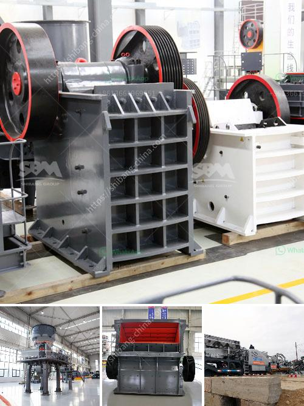

<h3>captains of crusher zenith</h3>
Crushers Zenith is a renowned fitness and strength training program that has gained popularity across the globe. At the helm of this incredible program are the captains, the driving force behind its success. These captains possess exceptional knowledge, skills, and experience, enabling them to push individuals beyond their limits and achieve remarkable results.

The captains of Crushers Zenith are more than just trainers; they are mentors, motivators, and role models. Their passion for fitness and dedication to helping others transform their lives are what set them apart. Each captain brings a unique perspective and expertise to the program, creating a dynamic and holistic training experience.

The foundation of Crushers Zenith lies in its focus on functional movements and compound exercises. Captains guide participants through a series of workouts that involve lifting heavy weights, performing intense cardio sessions, and mastering bodyweight movements. This comprehensive approach ensures that individuals not only build muscle and strength but also develop endurance and agility.

These captains possess an in-depth understanding of biomechanics and exercise physiology, enabling them to design customized training plans tailored to the specific needs and goals of their clients. They emphasize proper form and technique, ensuring that participants not only maximize their results but also reduce the risk of injury.

Additionally, the captains of Crushers Zenith are masters at pushing individuals beyond their comfort zones. They know how to motivate and inspire, challenging participants to go above and beyond what they believed possible. Through their guidance and support, they help participants unlock untapped potential and achieve significant progress in their fitness journey.

The success stories are a testament to the expertise of these captains. Clients of Crushers Zenith have experienced transformative changes in their bodies, mental strength, and overall well-being. From weight loss to muscle gain, increased energy levels to enhanced athletic performance, the results speak for themselves.

Captains of Crushers Zenith are reshaping the fitness industry with their unique approach to strength training. Through their knowledge, dedication, and ability to motivate, they are leading individuals towards a healthier and more fulfilling lifestyle. Whether you aspire to build muscle, improve performance, or simply enhance your physical fitness, entrusting your training to these captains is the first step towards achieving your goals. So, step into the world of Crushers Zenith and unlock your true potential under the guidance of these exceptional captains.
<h3>Contact us</h3><ul><li><strong>Whatsapp:&nbsp;<a href="https://wa.me/8613661969651">+8613661969651</a></strong></li><li><a href="https://swt.shibang-china.com/?git&amp;zhl&amp;captains of crusher zenith"><strong>Online Service(chat now)</strong></a></li></ul><h3>Related</h3><ul><li><a href='used vertical roller mill for sale.md'>used vertical roller mill for sale</a></li><li><a href='copper concentrate plant manufacturers in south africa.md'>copper concentrate plant manufacturers in south africa</a></li><li><a href='quartz stone powder manufacturing plant in india.md'>quartz stone powder manufacturing plant in india</a></li><li><a href='ball mill quartz lining suppliers.md'>ball mill quartz lining suppliers</a></li><li><a href='gypsum processing machine price list.md'>gypsum processing machine price list</a></li></ul>