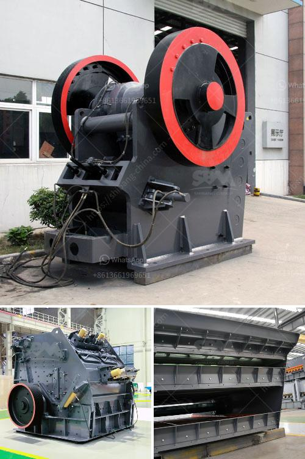

<h3>cement ball mill cement mill for sale</h3>
Cement is a kind of powder material which is extremely fine in nature and is mainly composed of clinker and a small amount of gypsum. It is widely used in the construction industry, civil engineering projects, and infrastructure projects, etc. With the rapid development of the construction industry, the demand for cement is also increasing day by day. Therefore, the cement ball mill, also known as the cement mill, plays a vital role in the cement production line.

The cement ball mill is a horizontal cylindrical rotating device, which is driven by gears, and driven by two chambers. It discharges fine particles and small particles by the pulp in the mill through the sieve plate. The material gradually passes through the cylinder, and the materials are crushed by the balls. Due to the continuous feeding of materials, the pressure in the mill keeps increasing, and the pulp gradually concentrates in the coarse grinding position. Therefore, the grinding efficiency of the cement ball mill is higher than that of the same specification of rod mill.

The cement ball mill equipment is composed of a horizontal cylinder, a hollow shaft for feeding and discharging materials, and a grinding head. The cylinder body is a long cylinder with a grinding body inside, made of steel. The cylinder is divided into several compartments by a partition plate, and a certain shape and size of grinding body is installed in each bin. The grinding body is generally made of steel ball, steel forging, etc., which is composed of different specifications of grinding body as required.

The cement ball mill has the characteristics of high production capacity, strong adaptability to materials, simple structure, easy maintenance, and reliable performance. It is especially suitable for the crushing and grinding of medium and small-sized cement plants. Its energy consumption is low, and its production capacity is high. It can grind the cement raw materials into fine powder at one time, which helps to improve the cement quality and reduce the energy consumption of the cement production line. 

Moreover, the cement ball mill has a wide range of application, and it can grind a variety of ores and other grindable materials in dry or wet grinding. It is widely used in cement, silicate products, new building materials, refractory materials, chemical fertilizers, non-ferrous metal processing, glass ceramics, and other industries. 

In summary, the cement ball mill is an indispensable grinding equipment for cement production line. It has the characteristics of large production capacity, energy saving, low noise, simple operation, and reliable performance. It can grind various ores and other grindable materials in dry or wet grinding. With the continuous development of the construction industry, the demand for cement will continue to rise. Therefore, the cement ball mill will play an increasingly important role in the cement production industry.
<h3>Contact us</h3><ul><li><strong>Whatsapp:&nbsp;<a href="https://wa.me/8613661969651">+8613661969651</a></strong></li><li><a href="https://swt.shibang-china.com/?git&amp;zhl&amp;cement ball mill cement mill for sale"><strong>Online Service(chat now)</strong></a></li></ul><h3>Related</h3><ul><li><a href='top ten cement plant epc contractor.md'>top ten cement plant epc contractor</a></li><li><a href='stone crushing machineries imphal.md'>stone crushing machineries imphal</a></li><li><a href='dolomite processing plan in ethiopia.md'>dolomite processing plan in ethiopia</a></li><li><a href='orifice of coal mill machine.md'>orifice of coal mill machine</a></li><li><a href='iron ore concentrate prices.md'>iron ore concentrate prices</a></li></ul>