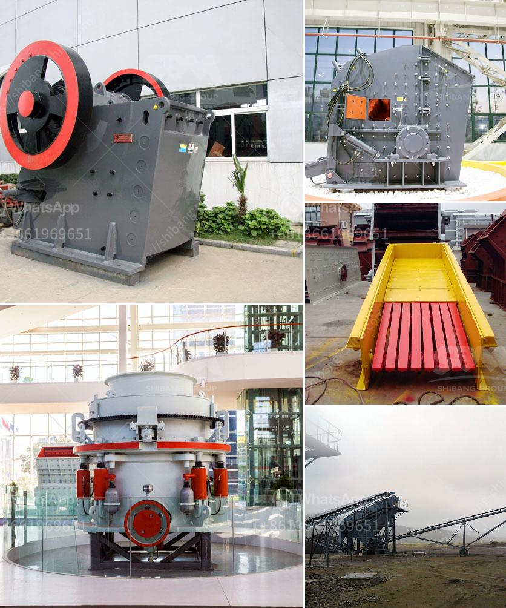

<h3>cement clinker processing machine</h3>
Cement production is a complex process that involves several steps, including raw material preparation, clinker production, and cement grinding. The production of cement clinker is a crucial stage in cement manufacturing, as it constitutes the key ingredient for the final product. To ensure the highest quality and enhance efficiency, the use of advanced machinery, such as cement clinker processing machines, is becoming increasingly popular in the industry.

A cement clinker processing machine is specifically designed to grind or pulverize clinker particles obtained from the kiln. This process aims to produce clinker powder with a specific surface area that allows for convenient mixing with additives to create cement. These machines typically consist of a rotating drum or cylinder, with steel balls or other grinding media inside, that crush the clinker particles. As the clinker is ground into fine powder, the machine also automatically categorizes it into different fractions based on the specific surface area.

One of the main advantages of using cement clinker processing machines is the improved efficiency they offer. These machines can grind clinker particles to a finer consistency than traditional methods, resulting in a higher surface area. This increased surface area allows for better chemical interaction between the clinker and additives during the cement production process, leading to improved strength and durability of the final product.

Furthermore, cement clinker processing machines are equipped with advanced technology and automation features that optimize their performance. These machines can be programmed to control the grinding process, including the speed of rotation, grinding media size, and time of operation. This level of control ensures consistent and precise production, as well as minimizes energy consumption and wear on the machine components.

Another significant benefit of cement clinker processing machines is their compact design and easy installation. These machines can be integrated into existing cement plants without major modifications, enabling manufacturers to upgrade their facilities and enhance production capacity. The compact design also ensures efficient use of space, particularly in plants with limited available area.

In addition to these performance advantages, cement clinker processing machines also contribute to environmental sustainability. The use of these machines reduces the overall energy consumption of the cement production process, resulting in lower greenhouse gas emissions. Additionally, their automation features minimize the need for human intervention, reducing the risk of accidents and improving worker safety.

Overall, cement clinker processing machines offer a comprehensive solution to enhance efficiency and productivity in cement production. Their ability to grind clinker particles to a fine consistency, along with advanced technology and automation features, ensures consistent and precise production. The compact design and easy installation facilitate their integration into existing plants, allowing manufacturers to upgrade their facilities and increase production capacity. Moreover, their contribution to environmental sustainability makes them an attractive investment for cement manufacturers aiming to reduce their carbon footprint.

As the cement industry continues to evolve and demand for high-quality cement grows, the integration of cement clinker processing machines becomes essential for manufacturers to stay competitive. Investing in these machines not only improves production efficiency but also ensures the production of high-quality cement that meets the growing demands of the construction industry.
<h3>Contact us</h3><ul><li><strong>Whatsapp:&nbsp;<a href="https://wa.me/8613661969651">+8613661969651</a></strong></li><li><a href="https://swt.shibang-china.com/?git&amp;zhl&amp;cement clinker processing machine"><strong>Online Service(chat now)</strong></a></li></ul><h3>Related</h3><ul><li><a href='clay grinder mill machine.md'>clay grinder mill machine</a></li><li><a href='crushed stone sorting machinery.md'>crushed stone sorting machinery</a></li><li><a href='crushed calcite manufacturer in rajasthan.md'>crushed calcite manufacturer in rajasthan</a></li><li><a href='jaw plate for jaw crusher breaker.md'>jaw plate for jaw crusher breaker</a></li><li><a href='aggregate crushing machine portable.md'>aggregate crushing machine portable</a></li></ul>