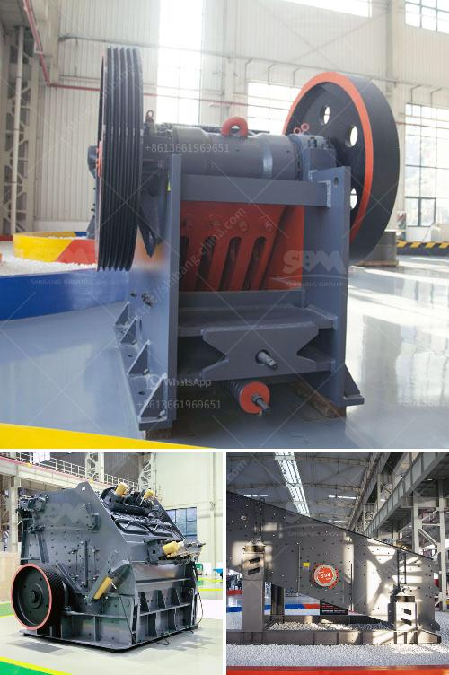

<h3>cement grinding mill suppliers</h3>
Cement grinding mill is an important equipment in the cement industry. Cement mill, also called cement ball mill, is a key equipment for grinding cement clinker into fine powder. Compared with traditional ball mills, it can increase the output by 15-20%. Mainly used in the cement silicate product industry, the cement mill belongs to horizontal rotating mill with circle flow grinding system. To a certain extent, cement mill can not only improve the quality of cement, but also ensure the production of cement.

As the key grinding equipment in the cement production line, cement grinding mill is also the equipment with the highest technical content and largest production demand. To choose a cement grinding mill supplier with high quality and good performance, we must have an accurate understanding of the comprehensive performance of each supplier's products and make a choice.

Firstly, we need to pay attention to the supplier's equipment manufacturing capabilities. Only manufacturers with high production capacity and advanced manufacturing technology can produce high-quality equipment. When choosing a supplier, we must choose a company with strong technical strength and advanced production equipment to ensure the quality of the cement grinding mill.

Secondly, we need to consider the supplier's after-sales service. Cement grinding mill is a kind of equipment with high wear resistance and long service life. In the actual operation process, it is necessary to carry out regular maintenance and repair. Therefore, the supplier's after-sales service is particularly important. It is necessary to choose a supplier with sound after-sales service system, which can provide comprehensive and timely technical support, professional maintenance guidance and other services to ensure the normal operation of the equipment.

Additionally, we should take cost factors into account. Cement grinding mill is a large-scale production equipment, and the price and cost are directly related to its production efficiency and quality. Although there are many suppliers in the market, the price and quality of their products are different. When choosing a supplier, we should not only focus on the low price, but also pay attention to the cost performance of the equipment, so as to choose a suitable supplier.

In conclusion, in order to choose a cement grinding mill supplier with high quality and good performance, we should pay attention to several aspects. First of all, we need to select a supplier with strong technical strength and advanced manufacturing technology. Secondly, it is necessary to choose a supplier with sound after-sales service system. Finally, cost factors should also be considered. Only by combining these factors can we make a wise choice and select the most suitable supplier. With the help of a high-quality cement grinding mill supplier, the cement production process will be more efficient and the product quality will be better.
<h3>Contact us</h3><ul><li><strong>Whatsapp:&nbsp;<a href="https://wa.me/8613661969651">+8613661969651</a></strong></li><li><a href="https://swt.shibang-china.com/?git&amp;zhl&amp;cement grinding mill suppliers"><strong>Online Service(chat now)</strong></a></li></ul><h3>Related</h3><ul><li><a href='price of grinding machine.md'>price of grinding machine</a></li><li><a href='starting a quarry business in nigeria.md'>starting a quarry business in nigeria</a></li><li><a href='quarry stone business plan in zimbabwe.md'>quarry stone business plan in zimbabwe</a></li><li><a href='types of grinding mills.md'>types of grinding mills</a></li><li><a href='toggle plate of jaw crusher.md'>toggle plate of jaw crusher</a></li></ul>