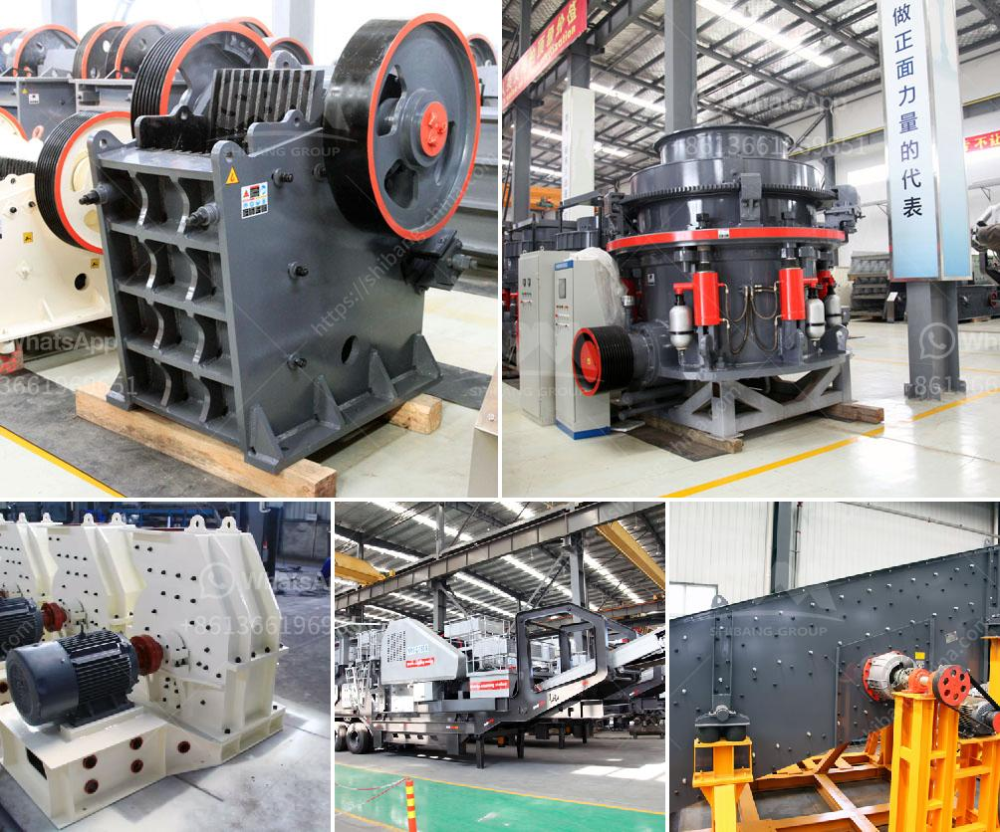

<h3>cement industry process</h3>
The cement industry is a vital part of the construction sector, responsible for the production of the concrete used in various infrastructure projects. The process of manufacturing cement involves several stages and is highly energy-intensive.

The first step in the cement production process is the extraction of raw materials such as limestone, shale, or clay from quarries or mines. These materials are crushed and transported to the cement plant, where they are stored and pre-blended to achieve the desired composition.

The next stage is the raw meal preparation, where the crushed materials are ground and mixed to form a fine powder called raw meal. This raw meal is then heated in a kiln at extremely high temperatures of around 1450°C, which causes chemical reactions known as calcination. During this process, the raw meal is transformed into clinker, a substance with angular granules about the size of marbles.

Once the clinker is formed, it is cooled and then ground into a fine powder, known as cement. Gypsum is added to regulate the setting time of the cement and prevent flash setting or hardening. After grinding, the cement is stored in silos ready for packaging and transportation.

The cement manufacturing process is energy-intensive and accounts for a significant portion of greenhouse gas emissions worldwide. The high temperatures required for calcination in the kiln and the use of fossil fuels contribute to these emissions. However, the industry has made efforts to reduce its environmental impact by implementing alternative fuels, such as biomass or waste materials, and adopting more energy-efficient technologies.

In conclusion, the cement industry plays a critical role in the construction sector by providing the essential material for concrete production. The process involves extracting raw materials, grinding them into a fine powder, and heating them in a kiln to form clinker. Despite its environmental challenges, the industry continues to innovate and find sustainable solutions to minimize its impact on the planet.
<h3>Contact us</h3><ul><li><strong>Whatsapp:&nbsp;<a href="https://wa.me/8613661969651">+8613661969651</a></strong></li><li><a href="https://swt.shibang-china.com/?git&amp;zhl&amp;cement industry process"><strong>Online Service(chat now)</strong></a></li></ul><h3>Related</h3><ul><li><a href='small rock crusher machine in india.md'>small rock crusher machine in india</a></li><li><a href='puzzolana 200tph cone crusher plant prices.md'>puzzolana 200tph cone crusher plant prices</a></li><li><a href='antimony processing plant in south africa.md'>antimony processing plant in south africa</a></li><li><a href='mobile stone crushing plant made in germany.md'>mobile stone crushing plant made in germany</a></li><li><a href='100 mt hr stone crusher machine.md'>100 mt hr stone crusher machine</a></li></ul>