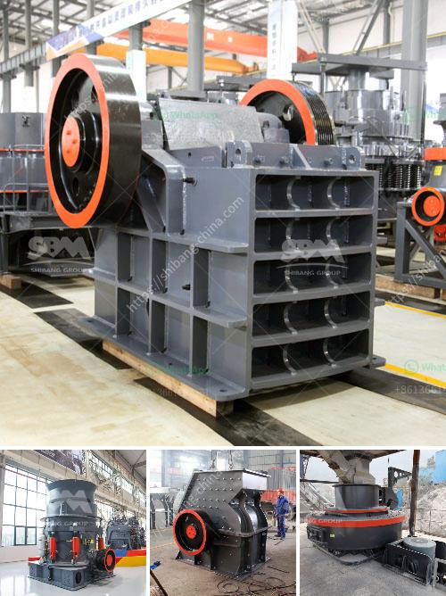

<h3>cement industry processes</h3>
Cement, an essential material in the construction industry, plays a vital role in building the infrastructure that supports our modern society. From building construction to roads and bridges, cement is the key ingredient that holds everything together. But have you ever wondered how cement is made? Let's explore the fascinating processes that go into the production of this versatile building material.

The first step in cement production is the extraction of raw materials. Limestone, clay, and shale are the primary components used in making cement. These materials are usually quarried from a nearby mine or extracted from a designated area. The process of extracting raw materials from the earth involves drilling, blasting, and transporting the rocks to the cement plant.

Once the raw materials arrive at the plant, they are crushed into smaller pieces. This crushing process is necessary to reduce the size of the rocks, making them easier to handle. Afterward, the crushed materials are transported to a rotary kiln, where the process of transforming them into cement begins.

The next stage is called clinker production, where the crushed materials are heated at extremely high temperatures. Inside the rotary kiln, the raw materials are subjected to temperatures reaching up to 1450 degrees Celsius. This intense heat causes a chemical reaction called calcination, where carbon dioxide and other volatile substances are expelled, leaving behind a material known as clinker.

Clinker is the intermediate product of cement production and resembles small marbles in appearance. It contains all the necessary chemical components required for cement. After leaving the rotary kiln, the clinker is cooled before being ground into a fine powder. This grinding process is performed in ball mills, which are rotating cylindrical steel containers filled with steel balls.

The next step is to mix the ground clinker with additives such as gypsum, limestone, and fly ash. These additives help to regulate the setting time and enhance the properties of the final cement product. The mixture is then finely ground once again, resulting in a fine powder called cement.

After the final grinding process, the cement is stored in large silos before being packaged or transported to construction sites. Different types of cement can be produced based on the specific properties required for a particular application. For example, rapid-hardening cement is ideal for quick construction projects, while sulfate-resistant cement is used in areas with high sulfate content and is less susceptible to deterioration.

The production of cement requires a significant amount of energy and releases carbon dioxide (CO2) into the atmosphere. Cement plants are actively exploring ways to reduce their carbon footprint by incorporating alternative fuels and employing energy-efficient technologies. Additionally, efforts are being made to develop innovative cement production processes that emit less greenhouse gases.

In conclusion, the cement industry is a complex and essential sector that forms the backbone of the construction industry. From quarrying raw materials to grinding clinker and ultimately producing cement, every step in the process is crucial to ensure the production of high-quality cement. As the demand for infrastructure continues to rise, the cement industry's focus on sustainability and innovation will play a significant role in shaping the future of construction.
<h3>Contact us</h3><ul><li><strong>Whatsapp:&nbsp;<a href="https://wa.me/8613661969651">+8613661969651</a></strong></li><li><a href="https://swt.shibang-china.com/?git&amp;zhl&amp;cement industry processes"><strong>Online Service(chat now)</strong></a></li></ul><h3>Related</h3><ul><li><a href='copper slag crusher machine manufacturer india.md'>copper slag crusher machine manufacturer india</a></li><li><a href='coal cushing and gdrinding machine.md'>coal cushing and gdrinding machine</a></li><li><a href='copper mining equipment suppliers south america.md'>copper mining equipment suppliers south america</a></li><li><a href='pf impact crusher for stone breaking machine for sale.md'>pf impact crusher for stone breaking machine for sale</a></li><li><a href='prices of conveyor belts for mining.md'>prices of conveyor belts for mining</a></li></ul>