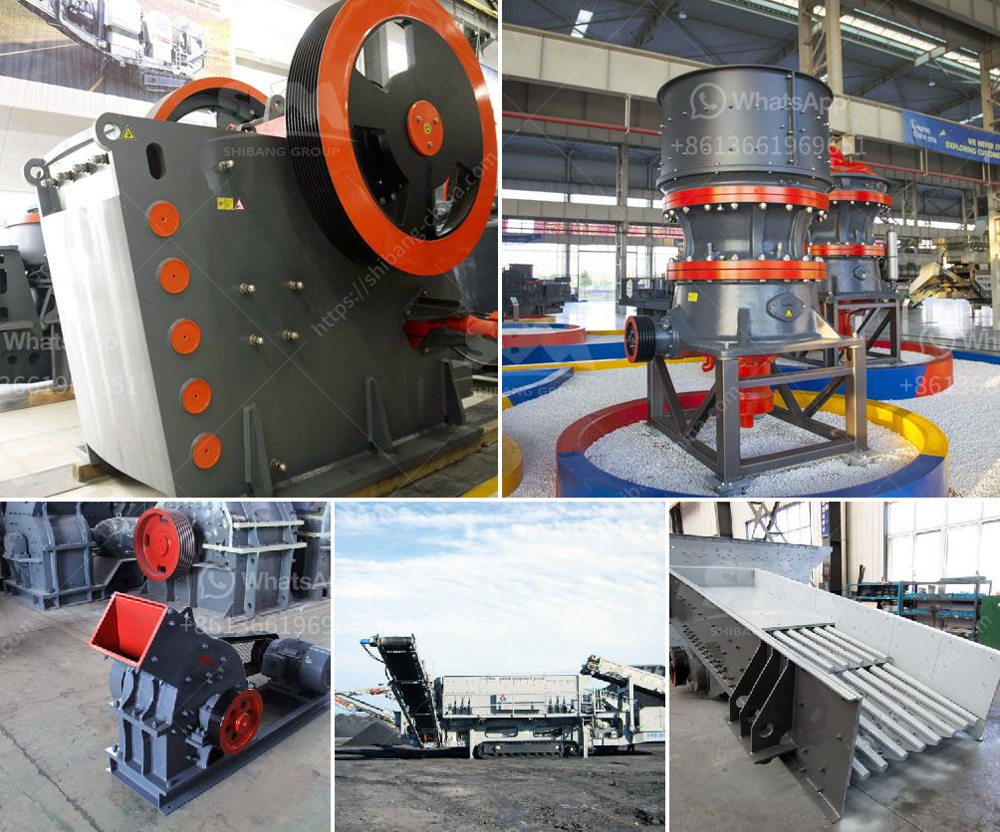

<h3>cement lime crusher</h3>
Cement production involves a wide range of activities such as mining, crushing, grinding, and mixing of raw materials. Limestone, a common material used in cement manufacture, undergoes crushing in the cement lime crusher. The cement lime crusher plays a crucial role in cement production line and cement making process.

Limestone, the key raw material of cement, is usually mined on site while most other materials are imported or produced locally. The mining of limestone usually requires blasting and mining equipment. The blasted rock is then loaded into large haul trucks and transported to a crusher to be crushed into smaller particles. After crushing, the limestone is mixed with other materials such as iron ore or fly ash, depending on the specific type of cement being produced.

The cement lime crusher is one of the most important equipment in cement production line and cement making process. It is the key equipment for re-crushing the materials after they are primarily crushed. It breaks down the raw materials into fine powder for use in the production process.

The cement lime crusher has a compact structure and a high output. It has a simple operation and is easy to maintain. Some of its key features include an adjustable discharge size and uniform particle size distribution. The crusher also has a long service life and a high crushing ratio, which ensures efficient and economical production.

Furthermore, the cement lime crusher is designed to reduce the energy consumption of the production process. It is equipped with efficient motors and bearings, which help to reduce power consumption and increase the overall efficiency of the cement plant. This not only helps to lower production costs but also reduces the environmental impact of cement production.

In conclusion, the cement lime crusher is an essential equipment in cement production line and cement making process. It plays a crucial role in the cement manufacturing process by crushing the raw materials into fine powder for use in the production process. Its compact structure, high output, and energy-saving features make it a valuable asset for any cement plant.
<h3>Contact us</h3><ul><li><strong>Whatsapp:&nbsp;<a href="https://wa.me/8613661969651">+8613661969651</a></strong></li><li><a href="https://swt.shibang-china.com/?git&amp;zhl&amp;cement lime crusher"><strong>Online Service(chat now)</strong></a></li></ul><h3>Related</h3><ul><li><a href='mining procedure in zambia.md'>mining procedure in zambia</a></li><li><a href='small gold rock crushers with chain.md'>small gold rock crushers with chain</a></li><li><a href='buy mobile crusher in usa.md'>buy mobile crusher in usa</a></li><li><a href='grinding media balls turkey.md'>grinding media balls turkey</a></li><li><a href='gold mining industry in tanzania.md'>gold mining industry in tanzania</a></li></ul>