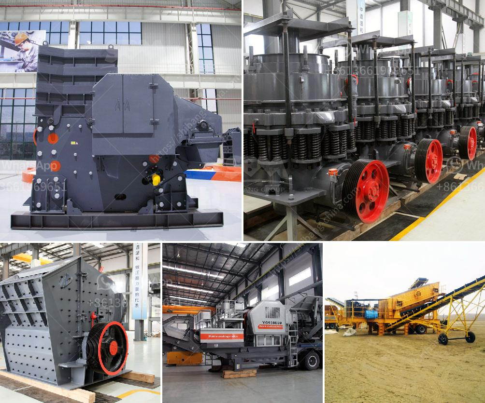

<h3>cement manufacturing process flow chart</h3>
Cement is the basic ingredient of construction materials, such as concrete and mortar. It is a finely powdered substance that is made by heating limestone and clay at high temperatures. The process of cement manufacturing involves several stages and each of them contributes to the quality of the final product.

The first stage of cement manufacturing is quarrying of the raw materials. These raw materials mainly consist of limestone and clay. The limestone is extracted from the quarries and transported to the crusher where it is crushed into smaller pieces. The clay is also crushed into a fine powder, and both the limestone and clay are sent to the mixer where they are mixed in the correct proportions.

Once the materials are properly mixed, they are fed into a rotary kiln. The kiln is a large cylinder-shaped furnace where the materials are heated to extremely high temperatures. During the heating process, chemical reactions take place that transform the raw materials into a substance known as clinker. The clinker is a solid material that is grayish-black in color and resembles small marble-like balls.

The clinker is then cooled down using air and stored in silos. From the silos, the clinker is transported to grinding mills where it is reduced to a fine powder. The grinding process increases the surface area of the clinker, making it more reactive when mixed with water.

The final stage of the cement manufacturing process is the addition of gypsum, also known as a performance enhancer. This is added in small amounts to control the setting time of cement and to enhance its properties.

Once the cement is produced, it is usually transported in bulk or packed in bags and ready for sale. Cement is a versatile material that is used in various construction projects, from building roads and bridges to erecting buildings and structures.

In conclusion, the cement manufacturing process involves several stages, including quarrying, crushing, mixing, heating, cooling, grinding, and adding gypsum. Each stage contributes to the overall quality of the final product. Cement is an essential ingredient in construction materials and plays a crucial role in the development of infrastructure worldwide.
<h3>Contact us</h3><ul><li><strong>Whatsapp:&nbsp;<a href="https://wa.me/8613661969651">+8613661969651</a></strong></li><li><a href="https://swt.shibang-china.com/?git&amp;zhl&amp;cement manufacturing process flow chart"><strong>Online Service(chat now)</strong></a></li></ul><h3>Related</h3><ul><li><a href='grinding machinery for sale in guatemala.md'>grinding machinery for sale in guatemala</a></li><li><a href='used gypsum plant for sale europe.md'>used gypsum plant for sale europe</a></li><li><a href='granite crushers manufacturers.md'>granite crushers manufacturers</a></li><li><a href='mobile crusher made in turkey.md'>mobile crusher made in turkey</a></li><li><a href='vertical grinding machine defination.md'>vertical grinding machine defination</a></li></ul>