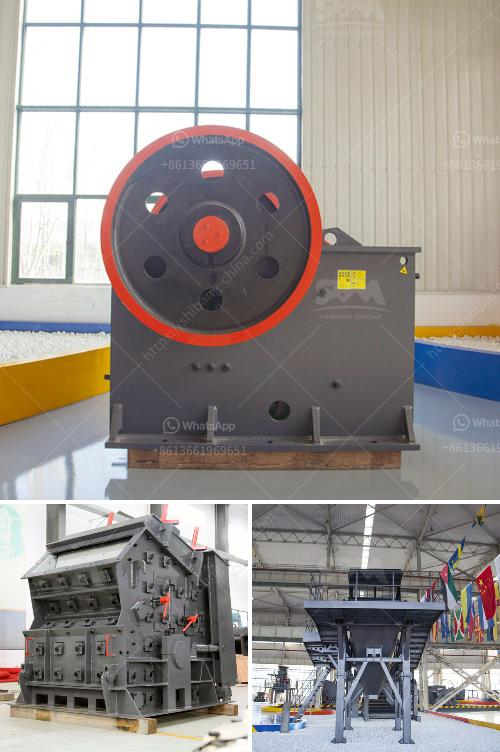

<h3>cement packing process</h3>
Cement, a crucial binding material for the construction industry, requires a well-planned and efficient packing process to ensure its proper storage and transportation. Cement packing involves the utilization of various machines and techniques that aid in achieving a high-quality and consistent product. This article delves into the cement packing process and provides an overview of how it is carried out.

The first step in the cement packing process is the collection of cement from silos or storage tanks. The cement is then transported to a packaging machine, where it is measured and weighed to ensure accurate packaging. Depending on the type of cement and specific requirements, different packaging options are available. Typically, cement is packaged in bags, big bags, or bulk powder form, which allows for easy handling and transportation.

Bag packaging is the most common method used in the cement industry. It involves the utilization of automated bagging machines that fill and seal the bags with cement. These machines have a high-speed operation, ensuring efficient packaging and minimizing the risk of human error. Bagged cement is usually packed in sizes ranging from 25kg to 50kg, making it suitable for various construction applications.

Big bag packaging is another popular method used for cement packing. In this process, bulk cement is manually or mechanically loaded into large bags. These bags, also known as Flexible Intermediate Bulk Containers (FIBC), can hold a significant amount of cement, ranging from 500kg to 2000kg. Big bags are ideal for large-scale projects, where a considerable amount of cement is required, as they simplify the handling process and reduce on-site labor.

Bulk powder form packaging is employed when large quantities of cement need to be transported to construction sites with cement tanker trucks. In this process, cement is directly loaded into the tanker trucks using specialized silos or hoppers. This method eliminates the need for bagging, reducing packaging costs and time. Bulk cement is widely used in projects that demand constant and high-volume supply, such as mass concrete constructions.

Once the cement is packed, additional measures are taken to ensure the product's safety and quality during transportation and storage. Each bag or big bag is labeled with important information such as cement type, weight, manufacturing date, and batch number. This labeling helps in traceability and quality control. Palletizing is also carried out to facilitate handling and prevent damage during transport. The packed cement is stacked on pallets, secured with shrink-wrapping or stretch film, and properly labeled with the necessary information for easy identification.

In conclusion, the cement packing process plays a vital role in the construction industry by ensuring the safe and efficient transport and storage of cement. The introduction of automated packing machines has significantly improved the speed and accuracy of cement packaging, reducing the risk of errors. Whether it is packed in bags, big bags, or bulk powder form, each packaging method has its merits and is chosen based on the specific project requirements. Additionally, proper labeling and palletization enhance the product's traceability and ease of handling. With an effective cement packing process in place, construction projects can proceed smoothly, and high-quality cement can be delivered to the worksite.
<h3>Contact us</h3><ul><li><strong>Whatsapp:&nbsp;<a href="https://wa.me/8613661969651">+8613661969651</a></strong></li><li><a href="https://swt.shibang-china.com/?git&amp;zhl&amp;cement packing process"><strong>Online Service(chat now)</strong></a></li></ul><h3>Related</h3><ul><li><a href='sell jaw crusher for turkey.md'>sell jaw crusher for turkey</a></li><li><a href='grinding lm vertical mill.md'>grinding lm vertical mill</a></li><li><a href='china best crusher manufacturers.md'>china best crusher manufacturers</a></li><li><a href='3 4 inch crushed limestone.md'>3 4 inch crushed limestone</a></li><li><a href='alluvial gold washing plant in zimbabwe.md'>alluvial gold washing plant in zimbabwe</a></li></ul>