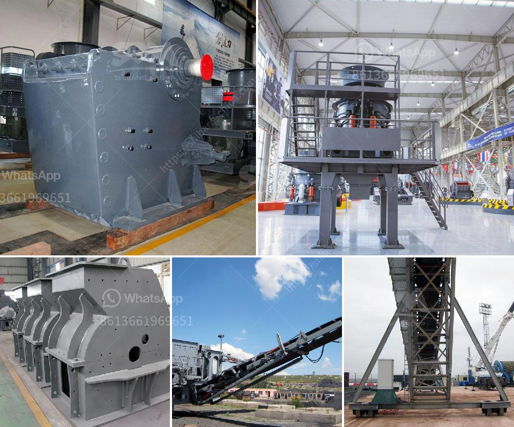

<h3>cement plant equipment</h3>
In the construction industry, cement plays a vital role in building strong foundations, structures, and infrastructures. To produce high-quality cement, cement plants require robust and efficient equipment. These equipment ensure the smooth and efficient functioning of various processes involved in cement manufacturing.

One of the essential equipment in a cement plant is the kiln. It is a large cylindrical furnace used to heat raw materials at high temperatures, typically around 1400-1500 degrees Celsius, to produce clinker. Clinker, the primary component of cement, is a sintered material obtained by heating limestone and other materials such as clay or shale. The kiln's ability to maintain high temperatures for an extended period is crucial for proper clinker formation.

Another indispensable equipment in cement plants is the cement mill. It is responsible for grinding clinker, additives, gypsum, and other raw materials into a fine powder. The finely ground material, known as cement, is then stored in silos to be transported to construction sites. Cement mills are designed to handle different types of cement and produce various grades of cement powder to meet specific construction requirements.

To ensure a continuous and uninterrupted flow of cement throughout the plant, efficient material handling equipment is necessary. Conveyors, bucket elevators, and airslides are commonly used to transport raw materials, clinker, and finished cement from one process to another. These equipment not only save time and labor but also prevent material spillage and ensure a dust-free environment.

In addition to the main equipment mentioned above, cement plants also rely on various auxiliaries to optimize production efficiency. One such auxiliary is the dust collector, commonly known as a bag filter. It is installed in different parts of the plant to capture and remove dust particles generated during the cement manufacturing process. By maintaining a clean and dust-free environment, dust collectors play a crucial role in ensuring the health and safety of workers and improving air quality in and around the plant.

Moreover, cement plants require reliable and energy-efficient motors to power various machinery throughout the plant. Motors used in cement plants are often subjected to harsh conditions such as high temperature, moisture, and dust. Hence, they need to be robust, durable, and resistant to these environmental factors.

To enhance the overall efficiency and productivity of cement plants, advanced automation and control systems are also becoming increasingly popular. These systems monitor and control various processes in real-time, providing operators with valuable insights and enabling them to make informed decisions. Automation not only improves operational efficiency but also reduces energy consumption, lowers maintenance costs, and enhances the quality of the final product.

In conclusion, cement plants rely on a wide range of equipment to efficiently produce high-quality cement. From the kiln and cement mill to material handling equipment and auxiliaries like dust collectors, each component plays a crucial role in the overall manufacturing process. By investing in modern and advanced equipment, cement plants can enhance efficiency, improve productivity, and ultimately contribute to the growth and development of the construction industry.
<h3>Contact us</h3><ul><li><strong>Whatsapp:&nbsp;<a href="https://wa.me/8613661969651">+8613661969651</a></strong></li><li><a href="https://swt.shibang-china.com/?git&amp;zhl&amp;cement plant equipment"><strong>Online Service(chat now)</strong></a></li></ul><h3>Related</h3><ul><li><a href='roller mill for dolmite.md'>roller mill for dolmite</a></li><li><a href='balls mill in uk.md'>balls mill in uk</a></li><li><a href='used clinker grinding mill for sale.md'>used clinker grinding mill for sale</a></li><li><a href='concrete stones crushing business plan.md'>concrete stones crushing business plan</a></li><li><a href='dolomite powder machine in sri lanka.md'>dolomite powder machine in sri lanka</a></li></ul>