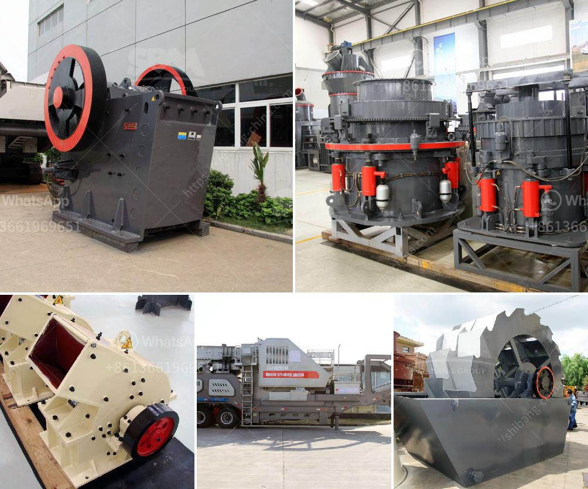

<h3>cement plant layout pdf</h3>
Cement manufacturing is a highly competitive industry, and the layout and design of a cement plant plays a crucial role in maximizing profits, reducing operating costs, and ensuring environmental sustainability. This article aims to explore the intricacies of cement plant layout, highlighting its importance, key components, and effective strategies to achieve an optimized layout.

The layout of a cement plant determines the efficiency and productivity levels that can be achieved. An optimized layout ensures a logical flow of materials, minimal bottlenecks, reduced transportation distances, and easy supervision of the manufacturing processes. Moreover, a properly planned layout facilitates effective waste management, energy conservation, and adherence to environmental regulations.

4. Kiln: The heart of the cement manufacturing process, where the raw materials are heated to high temperatures to produce clinker.

5. Cement Mill: The final stage of cement production, where the clinker is ground with additives to produce the desired quality cement.

1. Adequate Space Allocation: Ensuring sufficient areas for each process and equipment to avoid congestion and facilitate easy movement.

2. Streamlined Material Flow: Designing the layout to facilitate a smooth flow of materials, minimizing the time required for transportation and handling.

3. Location of Key Equipment: Placing critical equipment strategically, optimizing energy consumption and enhancing operational efficiency.

4. Integration of Automation: Incorporating advanced control systems and automation to optimize process control and reduce human error.

5. Environmental Considerations: Ensuring proximity to pollution control mechanisms, waste disposal facilities, and minimizing energy consumption through eco-friendly practices.

The layout of a cement plant significantly impacts its overall performance, productivity, and profitability. Implementing an optimized layout allows cement manufacturers to streamline operations, minimize costs, and adhere to environmental regulations. By considering the key components and employing effective strategies, cement plants can evolve into modern, efficient, and sustainable production facilities, enhancing their competitive position in the global market.
<h3>Contact us</h3><ul><li><strong>Whatsapp:&nbsp;<a href="https://wa.me/8613661969651">+8613661969651</a></strong></li><li><a href="https://swt.shibang-china.com/?git&amp;zhl&amp;cement plant layout pdf"><strong>Online Service(chat now)</strong></a></li></ul><h3>Related</h3><ul><li><a href='indonesia ball mill manufacturer.md'>indonesia ball mill manufacturer</a></li><li><a href='prices of conveyor belts for mining.md'>prices of conveyor belts for mining</a></li><li><a href='ball mill for mineral grinding india.md'>ball mill for mineral grinding india</a></li><li><a href='output of crushing plant.md'>output of crushing plant</a></li><li><a href='coal washing plant design.md'>coal washing plant design</a></li></ul>