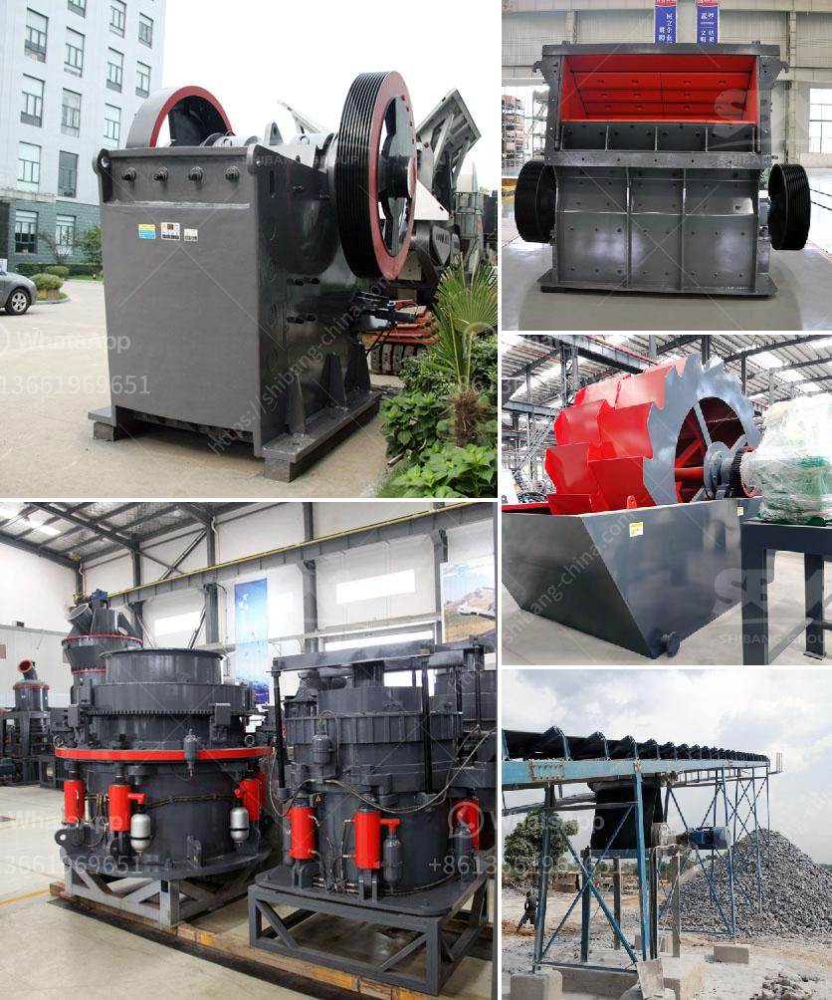

<h3>cement plant tons per day</h3>
The cement industry is a vital component of any nation's infrastructure development. It plays a crucial role in the construction of buildings, roads, bridges, and other infrastructure projects. One of the key metrics used in assessing the capacity of a cement plant is the number of tons of cement produced per day.

A cement plant's capacity is measured in terms of its production capacity in tons per day (tpd). This indicates the amount of cement that can be produced in a 24-hour period. The range of cement plant capacity varies from small-scale production plants (100 tpd) to large industrial plants with daily capacities of up to several thousand tons.

The daily production capacity of a cement plant directly affects its efficiency and profitability. A higher capacity allows the plant to meet increased demand, leading to enhanced sales and revenue. On the other hand, operating a plant below its maximum capacity might lead to wastage of resources and reduced efficiency.

To maximize the plant's capacity, various factors need to be considered, such as equipment selection, technological advancements, and process optimization. Upgrading machinery and adopting efficient production techniques can significantly increase a cement plant's output per day. Regular maintenance and monitoring of the plant's equipment and processes are also necessary to avoid any operational disruptions.

In addition to the production capacity, the energy efficiency and environmental impact of a cement plant are of growing concern. Adopting cleaner and greener production technologies can reduce energy consumption and mitigate the environmental effects associated with cement manufacturing.

In conclusion, the tons per day production capacity is a critical parameter for assessing the efficiency and profitability of a cement plant. With technological advancements and a focus on sustainable practices, cement plants can increase their daily output while minimizing their environmental footprint. This not only benefits the industry's growth but also promotes sustainable development in the infrastructure sector.
<h3>Contact us</h3><ul><li><strong>Whatsapp:&nbsp;<a href="https://wa.me/8613661969651">+8613661969651</a></strong></li><li><a href="https://swt.shibang-china.com/?git&amp;zhl&amp;cement plant tons per day"><strong>Online Service(chat now)</strong></a></li></ul><h3>Related</h3><ul><li><a href='limestone powder making machine.md'>limestone powder making machine</a></li><li><a href='rock crusher iron balls.md'>rock crusher iron balls</a></li><li><a href='dolomite processing plan in ethiopia.md'>dolomite processing plan in ethiopia</a></li><li><a href='how much does gold ore cost.md'>how much does gold ore cost</a></li><li><a href='fine powder grinders 30 50 microns.md'>fine powder grinders 30 50 microns</a></li></ul>