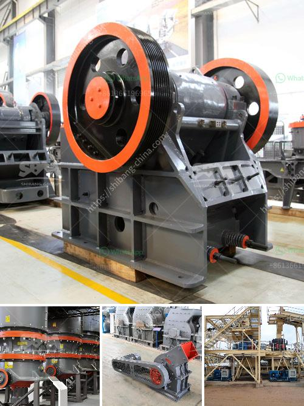

<h3>cement plants suppliers from china</h3>
Cement plants are essential industrial facilities that produce the key ingredient in concrete, which is used to construct various buildings and infrastructures worldwide. When it comes to cement plants suppliers, China has emerged as a global leader. With advanced technology, extensive experience, and competitive pricing, Chinese suppliers are highly sought after by construction companies around the world.

One of the main reasons why Chinese cement plant suppliers are so popular is their ability to provide cost-effective solutions without compromising quality. China's manufacturing industry has experienced significant growth over the years, enabling companies to achieve economies of scale. This allows them to produce cement plants at a lower cost while still maintaining high standards of performance and reliability.

Furthermore, Chinese cement plant suppliers are known for their advanced technology and innovation. They constantly invest in research and development to design and manufacture state-of-the-art equipment. These plants are equipped with the latest machinery and automation systems, enabling increased productivity, energy efficiency, and environmental sustainability.

Another advantage of choosing Chinese suppliers is their extensive experience. China has a vast domestic market, which means that these companies have years of experience in supplying cement plants to various projects, from small-scale constructions to large infrastructure developments. This experience translates into a better understanding of customer needs and industry requirements, ensuring that their products are tailored to meet specific demands.

Moreover, Chinese suppliers have a global outlook and are well-equipped to handle international transactions. They have a strong network and export infrastructure, making it easier for them to reach clients anywhere in the world. Additionally, they offer comprehensive after-sales services, including installation, training, and maintenance support, ensuring that customers have a seamless experience throughout the entire project.

In conclusion, Chinese cement plants suppliers have gained significant recognition in the global market due to their cost-effective solutions, advanced technology, extensive experience, and excellent customer service. With their commitment to quality and innovation, these suppliers continue to contribute to the growth and development of the construction industry worldwide.
<h3>Contact us</h3><ul><li><strong>Whatsapp:&nbsp;<a href="https://wa.me/8613661969651">+8613661969651</a></strong></li><li><a href="https://swt.shibang-china.com/?git&amp;zhl&amp;cement plants suppliers from china"><strong>Online Service(chat now)</strong></a></li></ul><h3>Related</h3><ul><li><a href='ball mills for grinding.md'>ball mills for grinding</a></li><li><a href='vertical shaft impact crusher plf.md'>vertical shaft impact crusher plf</a></li><li><a href='vibration grinding equipment.md'>vibration grinding equipment</a></li><li><a href='jaw crusher c160 menghancurkan peralatan.md'>jaw crusher c160 menghancurkan peralatan</a></li><li><a href='vertical vertical grinding machine.md'>vertical vertical grinding machine</a></li></ul>