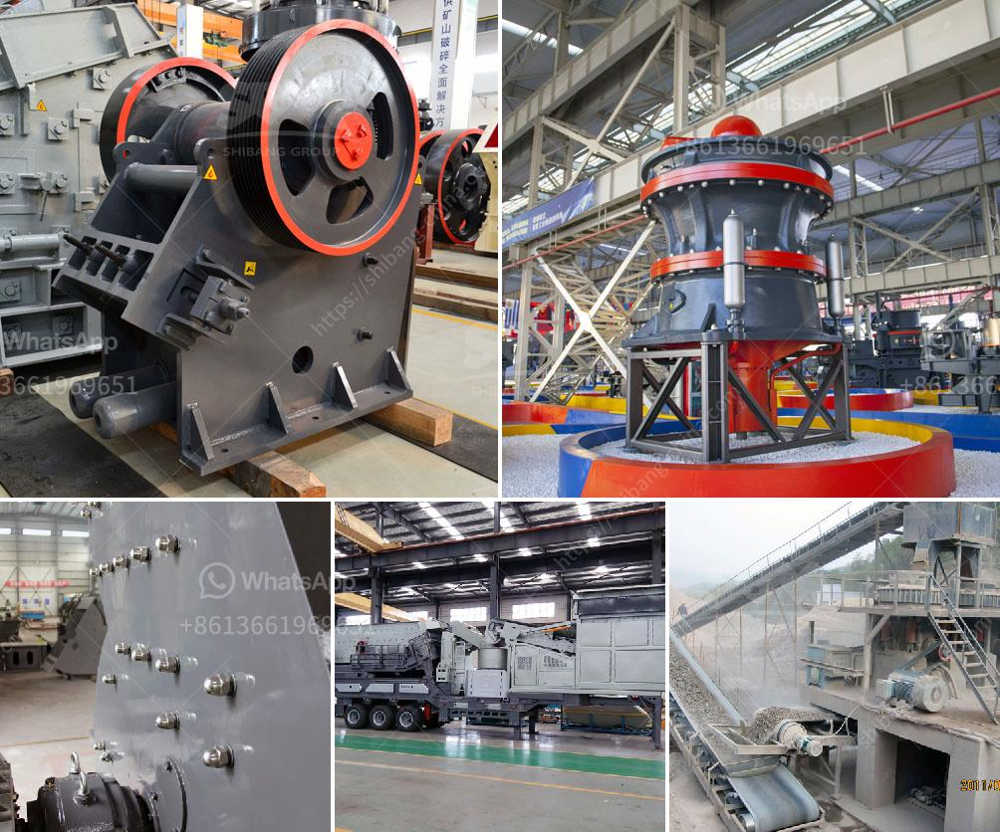

<h3>cement vertical roller mill price</h3>
Cement is a building material that is essential in today's construction industry. It is used extensively in the production of concrete, which is the most widely used man-made material in the world. Cement is produced by grinding clinker, a mixture of raw materials, with gypsum to create a fine powder. This process is usually carried out in a ball mill, a machine that grinds materials into a powdery form.

However, with advancements in technology, a new type of grinding machine called the cement vertical roller mill has gained popularity in recent years. This mill is equipped with rollers that rotate on a vertical axis, enabling them to grind the raw materials more efficiently. The cement vertical roller mill offers several advantages over the traditional ball mill, such as a lower power consumption, a smaller footprint, and a more efficient grinding process.

One of the key benefits of the cement vertical roller mill is its low energy consumption. Compared to ball mills, the power consumption of vertical roller mills is significantly lower. This is because the vertical mill does not have the friction between grinding balls and material, which results in lower wear and tear and subsequently less energy required to process the materials. This not only reduces the operating costs for cement manufacturers but also helps in reducing environmental impact by lowering carbon emissions.

Another advantage of the cement vertical roller mill is its small footprint. Traditional ball mills are large and require significant space for installation and operation. In contrast, the vertical roller mill has a compact design and occupies less space. This is especially beneficial in crowded urban areas where land is limited. The small footprint of the vertical mill also allows for easier retrofitting in existing cement plants, providing a cost-effective solution for upgrading equipment.

Furthermore, the cement vertical roller mill offers a more efficient grinding process. The rollers in the vertical mill exert grinding pressure on the material, pressing it against the grinding plate. This results in a more uniform and efficient grinding action compared to ball mills, where grinding balls randomly collide with the material. The vertical mill also allows for better control over particle size distribution, resulting in a more consistent product quality.

While the cement vertical roller mill offers numerous advantages, it is essential to consider the investment cost. The price of vertical roller mills can vary depending on factors such as production capacity, grinding fineness, and manufacturer. However, with advancements in technology and increased competition in the market, the price of vertical roller mills has become more affordable in recent years. Cement manufacturers can choose from a range of options that suit their specific requirements and budget.

In conclusion, the cement vertical roller mill offers several advantages over traditional ball mills, including lower energy consumption, a smaller footprint, and a more efficient grinding process. With improved technology and competitive pricing, it has become an attractive option for cement manufacturers seeking to upgrade their grinding equipment. The cement vertical roller mill price can vary depending on various factors, but it is now more affordable and accessible for the industry.
<h3>Contact us</h3><ul><li><strong>Whatsapp:&nbsp;<a href="https://wa.me/8613661969651">+8613661969651</a></strong></li><li><a href="https://swt.shibang-china.com/?git&amp;zhl&amp;cement vertical roller mill price"><strong>Online Service(chat now)</strong></a></li></ul><h3>Related</h3><ul><li><a href='crusher dealers in kenya.md'>crusher dealers in kenya</a></li><li><a href='plant project report pdf stone crushing.md'>plant project report pdf stone crushing</a></li><li><a href='grinder mill in malaysia.md'>grinder mill in malaysia</a></li><li><a href='stone crushers in bangalore.md'>stone crushers in bangalore</a></li><li><a href='used stone crushers in pakistan.md'>used stone crushers in pakistan</a></li></ul>