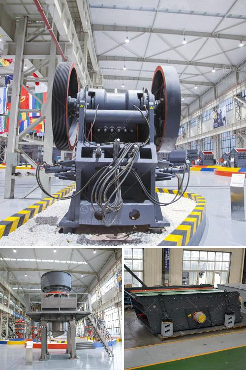

<h3>ceremacs ball mill pictures</h3>
Ceramic ball mills are a type of grinding mill traditionally used in the ceramics industry. These mills are cylindrical in shape and are often used for the grinding of various minerals, silicates, glass ceramics, and other materials. These mills have become increasingly popular in recent years due to their versatility and ability to efficiently grind materials to a fine particle size.

One of the key components of a ceramic ball mill is its lining material. This lining is typically made from abrasion-resistant ceramic tiles that are bonded onto a rubber or metal backing. The lining not only protects the cylindrical shell of the mill from wear and erosion but also enhances the grinding performance of the mill by improving the efficiency of the grinding media.

Ceramic ball mills are commonly used in the ceramics industry. However, they can also be used in the mineral processing, paint, chemicals, and other related industries. These mills are commonly used in applications where the grinding of materials is required to a desired particle size. These mills are especially effective in grinding materials that have a high hardness, such as minerals like limestone, granite, and iron ore.

To give you a better understanding of how ceramic ball mills work, here are some pictures showcasing these mills in action:

1. Picture 1: This picture shows a close-up view of a ceramic ball mill in operation. The material that is to be ground is loaded into the mill's chamber, and a rotating cylindrical ball media is used to grind it down to the desired particle size.

2. Picture 2: This picture shows a side view of a ceramic ball mill. The rotating cylindrical container is partially filled with balls of various sizes, which cascade down the surface as the mill rotates. The grindable material is introduced into the mill's chamber from one end, and the ground material is discharged from the other end.

3. Picture 3: This picture shows a top-down view of a ceramic ball mill. The mill's chamber is clearly visible, along with the rotating media and the material being ground. The size and shape of the media can vary depending on the desired particle size.

Overall, ceramic ball mills offer numerous advantages in the grinding process. They are durable, easy to operate, and have a high grinding efficiency. Additionally, the use of ceramic lining materials ensures a longer lifespan for the mill, reducing maintenance requirements and overall operating costs.

In conclusion, ceramic ball mills are an essential tool in the ceramics industry. Their versatility and efficiency make them ideal for grinding a wide range of materials to a fine particle size. The pictures provided give you a glimpse into the workings of these mills, showcasing their structure and operation. Whether used in the ceramics industry or other related fields, ceramic ball mills are a reliable and effective solution for processing materials.
<h3>Contact us</h3><ul><li><strong>Whatsapp:&nbsp;<a href="https://wa.me/8613661969651">+8613661969651</a></strong></li><li><a href="https://swt.shibang-china.com/?git&amp;zhl&amp;ceremacs ball mill pictures"><strong>Online Service(chat now)</strong></a></li></ul><h3>Related</h3><ul><li><a href='stone crusher machine pr ice in nepal.md'>stone crusher machine pr ice in nepal</a></li><li><a href='crushed crusher price.md'>crushed crusher price</a></li><li><a href='quartz stone powder manufacturing plant in india.md'>quartz stone powder manufacturing plant in india</a></li><li><a href='how much does a mobile crusher cost.md'>how much does a mobile crusher cost</a></li><li><a href='stone crusher machine sale germany.md'>stone crusher machine sale germany</a></li></ul>