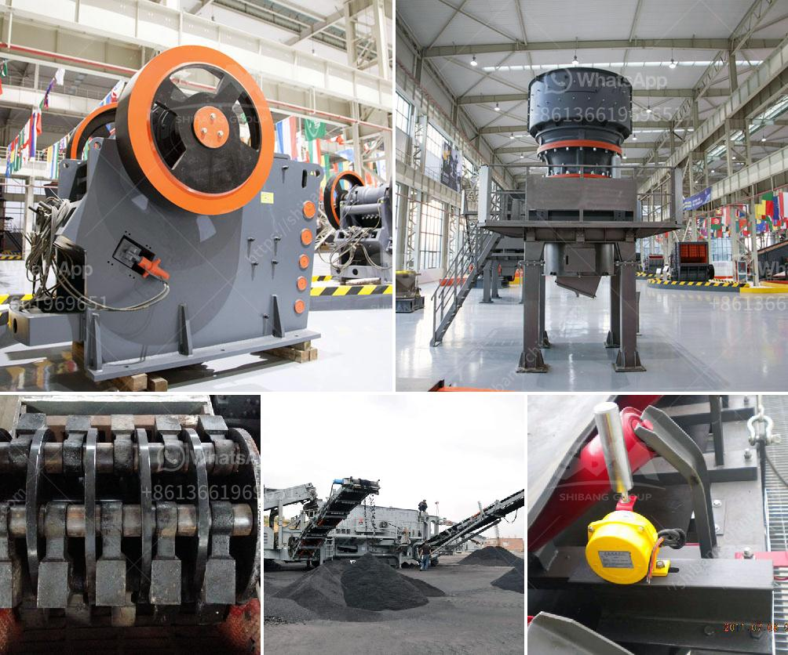

<h3>chart of accounts for cement factory</h3>
The chart of accounts plays a crucial role in the financial management and accounting system of any organization, including a cement factory. It is essentially a categorized listing of all the financial transactions and accounts used to record and track the company's financial activities. Let's explore the important aspects of a chart of accounts specifically tailored for a cement factory.

Firstly, the chart of accounts for a cement factory will include various categories to classify and organize different financial transactions and accounts. Some common categories might include assets, liabilities, equity, revenue, cost of goods sold, expenses, and various subsidiary ledgers. Each category will have multiple accounts to capture specific details related to financial transactions in the cement manufacturing process.

Under the asset category, accounts related to fixed assets, such as land, buildings, machinery, and equipment, will be included. These accounts will help track the company's investment in physical resources required for cement production. Additionally, accounts receivable and inventory accounts will be crucial to monitor outstanding payments from customers and track the raw materials and finished goods within the factory, respectively.

Liability accounts will reflect the company's obligations to pay off debts. This may include accounts payable, loans, and accrued liabilities such as taxes and other payables. These accounts will provide a clear picture of the company's outstanding financial obligations and help manage cash flow effectively.

Equity accounts will track the company's ownership interests, including capital contributions from shareholders and accumulated profits or losses over time. These accounts reflect the company's net worth and provide insights into its financial health and performance.

Revenue accounts will record the income generated from selling cement and related products. Sales revenue accounts specifically assigned to different products, such as bulk cement, bagged cement, and other related products, will help analyze the profitability of each product line. Revenue accounts will also include any additional income earned, such as rental income or interest.

Cost of goods sold accounts will capture the direct expenses incurred in the production of cement, including raw materials such as limestone, clay, gypsum, fuel, and electricity. These accounts will provide insights into the total cost involved in producing the units of cement and help calculate the gross profit margin.

Furthermore, various expense accounts will cover operating expenses such as employee salaries, maintenance costs, transportation, advertising, administrative costs, and utilities. These accounts will help monitor and control expenses to optimize the company's profitability.

In addition to the main categories mentioned above, subsidiary ledgers will further categorize specific accounts based on departments, divisions or cost centers within the cement factory. This allows for more detailed analysis and cost allocation for each aspect of the cement manufacturing process.

In conclusion, an effective and well-structured chart of accounts is essential for a cement factory to ensure accurate recording and tracking of financial activities. It provides a comprehensive framework to analyze the company's financial performance, manage cash flow, and make informed decisions. Implementing a tailored and robust chart of accounts is crucial for the efficient financial management of a cement factory.
<h3>Contact us</h3><ul><li><strong>Whatsapp:&nbsp;<a href="https://wa.me/8613661969651">+8613661969651</a></strong></li><li><a href="https://swt.shibang-china.com/?git&amp;zhl&amp;chart of accounts for cement factory"><strong>Online Service(chat now)</strong></a></li></ul><h3>Related</h3><ul><li><a href='200tph mobile crusher plant for rent in jharkhand.md'>200tph mobile crusher plant for rent in jharkhand</a></li><li><a href='portable crushers sweden.md'>portable crushers sweden</a></li><li><a href='gravel crushers machine.md'>gravel crushers machine</a></li><li><a href='harga stone crusher kapasitas 200 ton jam.md'>harga stone crusher kapasitas 200 ton jam</a></li><li><a href='quartz stone powder manufacturing plant in india.md'>quartz stone powder manufacturing plant in india</a></li></ul>