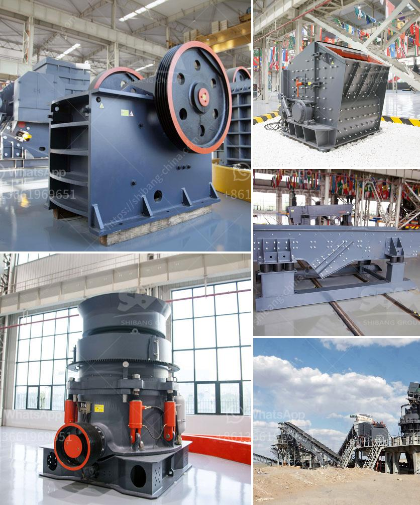

<h3>chaser mills for mica powder</h3>
Chaser mills for mica powder are essential equipment in the mica processing industry. These mills help in finely grinding and processing mica powder, which is used in various applications such as cosmetics, paint, rubber, plastic, and other industrial sectors. The use of chaser mills ensures the production of high-quality mica powder with precise particle size and consistent characteristics.

Chaser mills are primarily used for wet grinding. They consist of a vertical drum where the grinding stones or wheels are mounted. The mica flakes or scraps are fed into the mill, and the grinding wheels rotate at high speeds, causing the mica to be finely ground into powder. The resulting powder is then collected and further processed to meet specific customer requirements.

One of the key advantages of using chaser mills for mica powder is the ability to achieve a narrow particle size distribution. This uniformity in particle size plays a crucial role in the application of mica powder. For instance, in cosmetics and paint manufacturing, having consistent particle sizes ensures smooth and even application, enhancing the final product's quality and appearance. Chaser mills allow precise control over the grinding process, ensuring the desired particle size is achieved for each application.

Furthermore, chaser mills are known for their efficiency and durability. The grinding stones or wheels in chaser mills are typically made of high-quality materials such as granite or corundum. These materials are selected for their hardness and resistance to wear, enabling them to withstand repeated grinding operations without significant damage. The sturdy construction of chaser mills ensures long-term performance and reduces maintenance and replacement costs.

The wet grinding process in chaser mills also offers advantages over dry grinding methods. The addition of water or specialized liquid lubricants during grinding helps prevent the powder from becoming airborne and causing health and safety concerns. It also aids in reducing friction and heat generated during the grinding process, protecting the mica particles and maintaining their integrity.

In addition to ensuring optimal grinding performance, chaser mills can be customized to meet specific production requirements. The speed and direction of the grinding wheels can be adjusted to control the grinding intensity and output capacity. This flexibility allows manufacturers to adapt the milling process to suit different types of mica flakes and production volumes.

Overall, chaser mills for mica powder are indispensable equipment in the mica processing industry. They enable the production of high-quality mica powder with precise particle size distribution, offering numerous applications in various industries. The efficiency, durability, and customization options of chaser mills make them an essential investment for mica manufacturers aiming to deliver exceptional products to their customers.
<h3>Contact us</h3><ul><li><strong>Whatsapp:&nbsp;<a href="https://wa.me/8613661969651">+8613661969651</a></strong></li><li><a href="https://swt.shibang-china.com/?git&amp;zhl&amp;chaser mills for mica powder"><strong>Online Service(chat now)</strong></a></li></ul><h3>Related</h3><ul><li><a href='conveyor belt supplies south africa.md'>conveyor belt supplies south africa</a></li><li><a href='mica processing machinery pictures.md'>mica processing machinery pictures</a></li><li><a href='prices of complete crushing plant of baxter brand.md'>prices of complete crushing plant of baxter brand</a></li><li><a href='alluvial gold washing plant in zimbabwe.md'>alluvial gold washing plant in zimbabwe</a></li><li><a href='ton crushers south africa for sale.md'>ton crushers south africa for sale</a></li></ul>