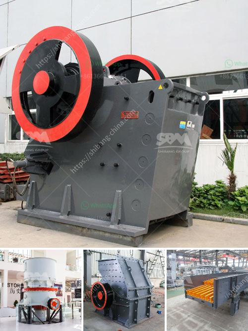

<h3>chelyabinsk crushers price</h3>
The Chelyabinsk Crushers have become a force to be reckoned with in the world of ice hockey. Known for their tenacity and hard-hitting style of play, the team has gained a loyal fan base and earned numerous accolades over the years. One key factor that has attributed to their success is the affordability of their tickets and merchandise, making them a popular choice for sports enthusiasts on a budget.

When it comes to pricing, the Chelyabinsk Crushers have opted for a fan-friendly approach. The team understands the importance of offering affordable options to attract a diverse range of supporters. Whether you are a die-hard fan or a casual viewer looking to experience the thrill of live hockey, there is a ticket option suitable for every budget. From the nosebleed sections to premium seating, the Crushers ensure that fans from all walks of life can partake in the excitement without breaking the bank.

The affordability extends beyond the ticket prices. The Chelyabinsk Crushers have a wide range of merchandise available at competitive prices. From jerseys to hats and everything in between, fans can proudly display their support for the team without emptying their wallets. This commitment to keeping prices reasonable shows that the Crushers value their supporters and want to provide them with a memorable experience both on and off the ice.

But don't let the affordable prices fool you - the Chelyabinsk Crushers deliver a high level of performance. The team consistently showcases their skill and determination, winning games and entertaining their fans. The players' dedication to their craft is evident every time they step onto the ice, ensuring an intense and exciting match for spectators. The Crushers have garnered a reputation for their aggressive style of play, which only serves to further energize the crowd.

While the ticket prices and merchandise affordability may be enticing, it is important to note that quality is not compromised. The Chelyabinsk Crushers have invested in cultivating a talented roster of players and coaches who are committed to pushing the boundaries of the sport. The team's success is a testament to their hard work and preparation, resulting in an exhilarating on-ice experience for fans.

In conclusion, the Chelyabinsk Crushers have found the perfect balance between affordability and performance. By keeping ticket prices and merchandise costs reasonable, they have managed to attract a wide range of supporters, solidifying their position as a beloved hockey team. The Crushers' commitment to providing an unforgettable experience for fans is evident in their pricing strategy and the skills displayed on the ice. Whether you are a long-time supporter or a newcomer to the sport, the Chelyabinsk Crushers offer an unforgettable experience suitable for all fans.
<h3>Contact us</h3><ul><li><strong>Whatsapp:&nbsp;<a href="https://wa.me/8613661969651">+8613661969651</a></strong></li><li><a href="https://swt.shibang-china.com/?git&amp;zhl&amp;chelyabinsk crushers price"><strong>Online Service(chat now)</strong></a></li></ul><h3>Related</h3><ul><li><a href='chinese manufacturer for crusher screens vibrating feeders.md'>chinese manufacturer for crusher screens vibrating feeders</a></li><li><a href='400 tph mobile coal crusher plant manufacturer.md'>400 tph mobile coal crusher plant manufacturer</a></li><li><a href='3 meters conveyor belts.md'>3 meters conveyor belts</a></li><li><a href='crusher plant dealer in pakistan.md'>crusher plant dealer in pakistan</a></li><li><a href='ton per hour hammer mill grinding mill china.md'>ton per hour hammer mill grinding mill china</a></li></ul>