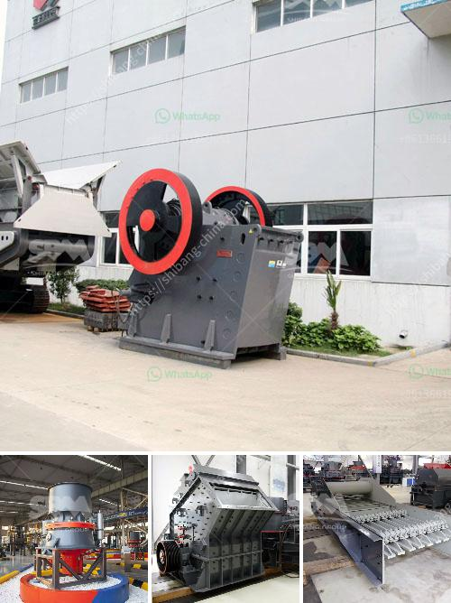

<h3>china best crusher manufacturers</h3>
China has emerged as a global manufacturing powerhouse, with a wide range of industries producing high-quality products. When it comes to crushers, China has some of the best manufacturers in the world. These manufacturers have a wealth of experience and expertise in producing crushers that are efficient, durable, and reliable, making them highly sought after by both domestic and international customers.

One of the leading crusher manufacturers in China is Shanghai SBM Machinery Co., Ltd. This company offers advanced technology and high-quality products that can be used in a variety of industrial applications. With over 30 years of experience in the industry, Shanghai SBM Machinery has established itself as a reliable and trustworthy manufacturer.

Another top crusher manufacturer in China is Zhengzhou Hongxing Mining Machinery Co., Ltd. Known for its excellent products and customer service, this company has a strong reputation in the industry. Zhengzhou Hongxing Mining Machinery offers a wide range of crushers, including jaw crushers, impact crushers, cone crushers, and more. These crushers are designed to provide high performance and durability, ensuring that customers get the most value for their money.

Xinxiang Dingli Mining Equipment Co., Ltd. is also one of the best crusher manufacturers in China. This company specializes in the production of large and medium-sized crushers, including hammer crushers, impact crushers, and jaw crushers. With a team of experienced engineers and a state-of-the-art manufacturing facility, Xinxiang Dingli Mining Equipment Co., Ltd. is able to deliver high-quality crushers that meet the needs of customers from different industries.

In addition to these manufacturers, there are several other crusher manufacturers in China that are worth considering. For example, Taizhou Weitian Machinery Co., Ltd. specializes in the production of plastic crushers, which are widely used in the recycling industry. Jiangsu Pengfei Group Co., Ltd., on the other hand, is known for its expertise in the production of cement crushers.

When choosing a crusher manufacturer in China, it is important to consider factors such as the quality of the products, the reputation of the manufacturer, and the after-sales service provided. The best manufacturers ensure that their products are of the highest quality, backed by rigorous testing and quality control processes. They also have a strong reputation in the industry, with positive reviews and feedback from customers. Finally, they offer excellent after-sales service, including warranties, technical support, and spare parts availability.

China is home to some of the best crusher manufacturers in the world. These manufacturers offer a wide range of crushers that are efficient, durable, and reliable, making them suitable for various industrial applications. Whether you need a crusher for mining, construction, recycling, or any other industry, you can find the right crusher manufacturer in China. With their advanced technology, high-quality products, and excellent customer service, these manufacturers are sure to meet your needs and exceed your expectations.
<h3>Contact us</h3><ul><li><strong>Whatsapp:&nbsp;<a href="https://wa.me/8613661969651">+8613661969651</a></strong></li><li><a href="https://swt.shibang-china.com/?git&amp;zhl&amp;china best crusher manufacturers"><strong>Online Service(chat now)</strong></a></li></ul><h3>Related</h3><ul><li><a href='gypsum crusher specification.md'>gypsum crusher specification</a></li><li><a href='price of stone crusher capacitytons an hour.md'>price of stone crusher capacitytons an hour</a></li><li><a href='crusher suppliers usa.md'>crusher suppliers usa</a></li><li><a href='stone crusher for sale in usa.md'>stone crusher for sale in usa</a></li><li><a href='orifice of coal mill machine.md'>orifice of coal mill machine</a></li></ul>