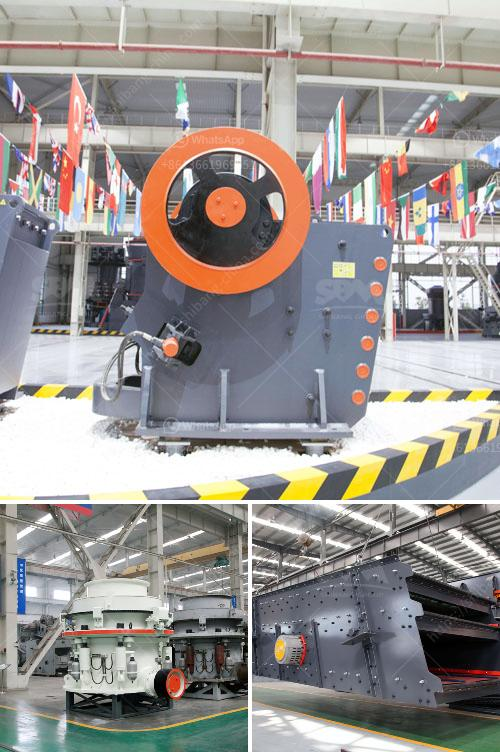

<h3>china clay grinding machine</h3>
China clay, also known as kaolin, is a soft white clay material that is widely used in a variety of industries including ceramic, rubber, and paper making. It is produced by the weathering of feldspar, an aluminum silicate mineral. China clay is known for its low shrinkage, high green strength, and excellent rheological properties due to its unique particle size and shape.

To process china clay into fine powder, we need a grinding machine. The traditional grinding methods, such as using a hammer mill or ball mill grinder, are not efficient for this type of material. Instead, china clay grinding machines have their own specific requirements that must be taken into account when choosing a suitable machine for manufacturing.

In order to break down the large chunks of china clay into smaller particles and achieve the desired fineness, the material needs to go through several stages of grinding. Care must be taken to ensure that the machine used is able to handle the specific characteristics of china clay. These characteristics include its unique particle shape, its moisture content, and its abrasive nature.

One machine that is commonly used for china clay grinding is the impact mill. This mill is designed to grind abrasive materials, such as china clay, without the need for screens or classifiers. It utilizes a high-speed rotating impeller to create the centrifugal force needed to generate impact with the particles. This impact breaks down the material into smaller particles, resulting in a fine powder.

Another machine that can be used for china clay grinding is the ball mill. This mill works on the principle of impact and attrition. It consists of a horizontal rotating cylinder filled with steel balls that grind the material as the cylinder rotates. The ball mill is able to grind china clay into fine powder with high efficiency and low energy consumption.

There are also other types of grinding machines that can be used for china clay processing. These include the Raymond mill, the vertical roller mill, and the ultrafine mill. These machines operate on similar principles, but they differ in terms of their capacity, efficiency, and final product size.

In conclusion, grinding china clay requires a specific type of machine that is capable of grinding abrasive materials without the need for screens or classifiers. The impact mill and the ball mill are both suitable choices for grinding china clay into fine powder. Other machines, such as the Raymond mill, the vertical roller mill, and the ultrafine mill, can also be used depending on the specific requirements of the manufacturing process. Regardless of the machine chosen, it is important to ensure that it is able to handle the unique characteristics of china clay to ensure optimal grinding performance.
<h3>Contact us</h3><ul><li><strong>Whatsapp:&nbsp;<a href="https://wa.me/8613661969651">+8613661969651</a></strong></li><li><a href="https://swt.shibang-china.com/?git&amp;zhl&amp;china clay grinding machine"><strong>Online Service(chat now)</strong></a></li></ul><h3>Related</h3><ul><li><a href='jaw crushing machine.md'>jaw crushing machine</a></li><li><a href='cement lime crusher.md'>cement lime crusher</a></li><li><a href='sand washing plant suppliers.md'>sand washing plant suppliers</a></li><li><a href='coal crusher and screen plant for sale.md'>coal crusher and screen plant for sale</a></li><li><a href='gypsum powder dryer price pakistan.md'>gypsum powder dryer price pakistan</a></li></ul>