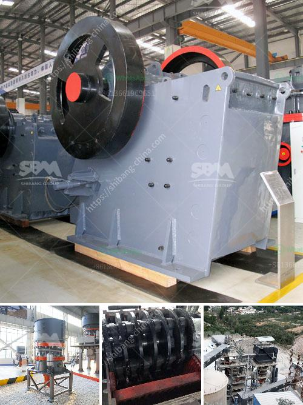

<h3>china crusher exporters mails hotmail com</h3>
China's crusher exporters have significantly contributed to the global mining and construction industry with their high-quality machinery and innovative solutions. This article delves into the prowess of Chinese crusher exporters and sheds light on their impact on the industry. In this context, we will specifically focus on China crusher exporters using hotmail.com mail addresses.

China's rapid industrialization and advancement in manufacturing have propelled the country to become the world's largest producer and consumer of crusher machinery. Chinese exporters have tapped into this growing demand and capitalized on their expertise to offer cost-effective and efficient crusher solutions.

Crusher exporters from China invest heavily in research and development to ensure their machinery meets industry standards and offers advanced technological features. These companies prioritize quality assurance and regularly upgrade their crushers to keep up with the evolving needs of their customers. By continuously innovating, these exporters have established themselves as leaders in the global crusher market.

Chinese crusher exporters offer an extensive range of products to cater to various industry needs. From jaw crushers, impact crushers, cone crushers, to vertical shaft impactors, these companies have a diverse portfolio to suit different applications. Customers can choose from a wide range of sizes, power capacities, and specifications, ensuring their specific requirements are met.

One of the key advantages of Chinese crusher exporters is their ability to offer products at competitive prices. With the massive scale of manufacturing in China, these exporters benefit from cost advantages, making their machinery significantly more affordable than offerings from other countries. The affordability of Chinese crushers has made them accessible to a broader range of customers worldwide.

Chinese crusher exporters also understand the importance of international collaborations. They actively seek partnerships and joint ventures with global companies to expand their market reach. These collaborations help them gain a better understanding of the local needs and preferences of their customers, allowing them to tailor their products accordingly.

In recent years, Chinese crusher exporters have made significant efforts towards ensuring sustainability and environmental responsibility. These companies have invested in eco-friendly technologies and implementations, including improved energy efficiency, reduced emissions, and adoption of greener materials. Such initiatives not only promote a cleaner environment but also align with global sustainability goals.

Chinese crusher exporters, including those using hotmail.com mail addresses, have emerged as key players in the global crusher market. Their emphasis on quality, technological advancements, competitive pricing, and international collaborations have propelled them ahead of their competitors. With their extensive range of products and a keen focus on sustainability, Chinese crusher exporters are poised to shape the future of the mining and construction industry.
<h3>Contact us</h3><ul><li><strong>Whatsapp:&nbsp;<a href="https://wa.me/8613661969651">+8613661969651</a></strong></li><li><a href="https://swt.shibang-china.com/?git&amp;zhl&amp;china crusher exporters mails hotmail com"><strong>Online Service(chat now)</strong></a></li></ul><h3>Related</h3><ul><li><a href='stone rock crushers in oman for sale.md'>stone rock crushers in oman for sale</a></li><li><a href='200tph mobile crusher plant for rent in jharkhand.md'>200tph mobile crusher plant for rent in jharkhand</a></li><li><a href='station de concassage daun une carriere.md'>station de concassage daun une carriere</a></li><li><a href='quarry operations business plan.md'>quarry operations business plan</a></li><li><a href='silica processing company.md'>silica processing company</a></li></ul>