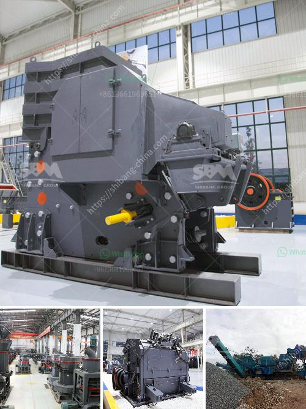

<h3>chinese manufacturer for crusher screens vibrating feeders</h3>
China has acquired a reputation as a country with a rapidly growing economy and manufacturing sector. In the past decade, it has witnessed unprecedented development in the numerous industrial sectors, including the mining equipment industry. As an essential part of mining machinery, Vibrating feeders are widely used in the mining industry. With the rapid development of the Chinese economy, there has been a surge in the demand for crusher screens, vibrating feeders, and other mining equipment. Chinese manufacturers have successfully entered the market and have gained a strong foothold with their high-quality products.

One of the leading Chinese manufacturers of mining equipment, China National Heavy Machinery Corp (CHMC), has been producing crusher screens and vibrating feeders since its establishment in 1969. CHMC has grown to become an eminent player in the global market due to its high quality and robust engineering solutions. The company has established strong relationships with customers worldwide due to its commitment to providing superior products and excellent customer service.

One of the key factors contributing to the success of Chinese manufacturers like CHMC is their ability to adapt to the changing needs of the global market. They continuously invest in research and development to innovate their products and improve their performance. As a result, their crusher screens and vibrating feeders incorporate the latest technologies and are highly efficient in their operations. They are designed to withstand the extreme conditions in the mining industry, ensuring long-lasting performance and minimal downtime.

Chinese manufacturers also excel in cost-effectiveness. They have established streamlined production processes and optimized supply chains to reduce production costs without compromising on quality. This enables them to offer their products at competitive prices, making them an attractive option for customers looking for reliable and durable mining equipment.

Furthermore, Chinese manufacturers are known for their strong focus on customer satisfaction. They have set up comprehensive after-sales service networks to provide efficient technical support and maintenance services to their customers worldwide. This ensures that customers can rely on their crusher screens and vibrating feeders for trouble-free operation and maximum productivity.

In recent years, Chinese manufacturers have also been proactive in adopting environmentally friendly practices. They have implemented measures to reduce energy consumption and minimize waste generation during the production process. This demonstrates their commitment to sustainable manufacturing and their contribution to the global environmental goals.

However, it is important to note that not all Chinese manufacturers are created equal. Customers should conduct thorough research and due diligence before selecting a supplier. They should consider factors such as the company's reputation, certifications, and customer reviews to ensure they are dealing with a reputable and reliable supplier.

In conclusion, Chinese manufacturers have emerged as major players in the global market for crusher screens and vibrating feeders. Their commitment to quality, innovation, cost-effectiveness, and customer satisfaction has led to their rapid growth and strong presence worldwide. With an emphasis on technology and sustainability, Chinese manufacturers continue to provide high-performance mining equipment that meets the evolving needs of the industry. As China's economy continues to grow, its manufacturers are set to play an even more significant role in shaping the future of the global mining equipment market.
<h3>Contact us</h3><ul><li><strong>Whatsapp:&nbsp;<a href="https://wa.me/8613661969651">+8613661969651</a></strong></li><li><a href="https://swt.shibang-china.com/?git&amp;zhl&amp;chinese manufacturer for crusher screens vibrating feeders"><strong>Online Service(chat now)</strong></a></li></ul><h3>Related</h3><ul><li><a href='raymond used mill for sale.md'>raymond used mill for sale</a></li><li><a href='crusher plant supplier in nepal.md'>crusher plant supplier in nepal</a></li><li><a href='stone crusher for sale gumtree.md'>stone crusher for sale gumtree</a></li><li><a href='philippines crushing machine manufacturer in pakistan.md'>philippines crushing machine manufacturer in pakistan</a></li><li><a href='high capacity high quality cone crusher to rent.md'>high capacity high quality cone crusher to rent</a></li></ul>