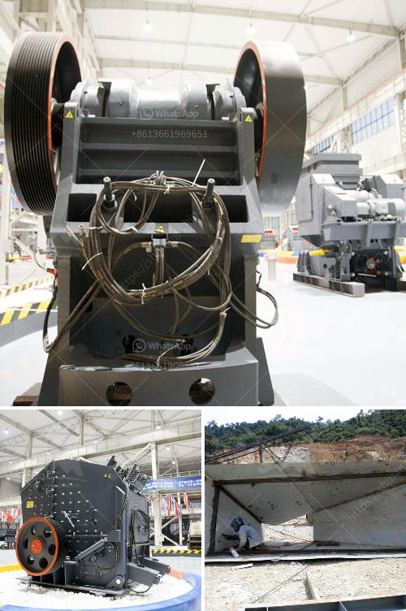

<h3>chinese tracked stone crushers</h3>
The development of urban areas creates an increasing demand for aggregate materials in construction projects. This can result in excessive transportation costs and environmental pollution. To address these issues, the Chinese construction industry has been investing in a range of construction equipment, including crushers, to meet their aggregate needs.

Chinese tracked stone crushers are mobile crushing plants specifically designed for limiting the transportation costs and reducing the environmental pollution caused by mining operations. Relying on caterpillar tracks, these crushers can be positioned in any location within a construction site, making the process more efficient and convenient.

One of the key advantages of Chinese tracked stone crushers is their ability to move effortlessly around the job site. These crushers can be easily transported from one location to another, reducing the need for additional transportation equipment. As a result, the overall cost of the project is significantly reduced, allowing construction companies to invest their resources in other critical areas.

Furthermore, Chinese tracked stone crushers are designed to be multifunctional, providing a wide range of capabilities. These crushers can handle not only rock and aggregate materials but also concrete, asphalt, and demolition waste. This versatility helps construction companies minimize their expenses by reducing the need for specialized equipment.

Additionally, Chinese tracked stone crushers are equipped with advanced technology features that enhance their performance and efficiency. For instance, many of these crushers are fitted with a vibrating feeder, which allows for a steady flow of material into the crusher and prevents any potential clogging. This guarantees a consistent production of high-quality aggregates.

Another notable feature is the powerful crushing mechanism employed by Chinese tracked stone crushers. With their strong jaw crushers or impact crushers, these machines can effectively break down even the hardest rocks, ensuring a fine-grained final product for construction purposes.

Moreover, the Chinese tracked stone crushers are designed to be environmentally friendly. These crushers are equipped with dust suppression systems and noise reduction features, minimizing the impact on the surrounding environment and providing safer working conditions for the operators.

In conclusion, Chinese tracked stone crushers offer a cost-effective and efficient solution for construction projects. Their mobility and versatility allow them to be used in various locations, reducing transportation costs and pollution. Additionally, the advanced technology features enhance their performance and ensure high-quality aggregates. Furthermore, these crushers are designed with environmental considerations in mind, making them a sustainable choice for construction companies. As the demand for aggregate materials continues to grow, Chinese tracked stone crushers are sure to play a pivotal role in meeting the needs of the construction industry.
<h3>Contact us</h3><ul><li><strong>Whatsapp:&nbsp;<a href="https://wa.me/8613661969651">+8613661969651</a></strong></li><li><a href="https://swt.shibang-china.com/?git&amp;zhl&amp;chinese tracked stone crushers"><strong>Online Service(chat now)</strong></a></li></ul><h3>Related</h3><ul><li><a href='quartz stone powder manufacturing plant in india.md'>quartz stone powder manufacturing plant in india</a></li><li><a href='business plan for small scale chrome mining.md'>business plan for small scale chrome mining</a></li><li><a href='cone crusher plant for sale.md'>cone crusher plant for sale</a></li><li><a href='slag grindimg in ball mill.md'>slag grindimg in ball mill</a></li><li><a href='concrete crushing machine in india.md'>concrete crushing machine in india</a></li></ul>