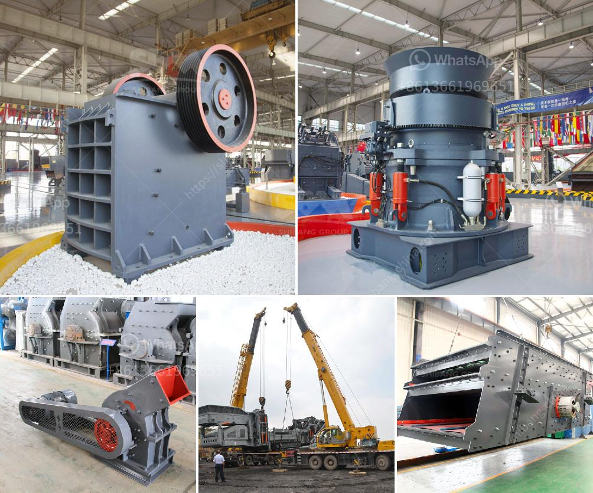

<h3>clay grinder mill machine</h3>
The use of clay grinder mill machines in industries is gaining momentum due to their numerous benefits. These machines are designed to finely grind clay, producing a high-quality clay powder that can be used in various applications.

Clay is a versatile natural material that has been used for centuries in industries such as pottery, ceramics, construction, and agriculture. However, the processing of clay requires it to be finely ground into a powder form, which can be a time-consuming and labor-intensive process. This is where clay grinder mill machines come into play.

A clay grinder mill machine is a powerful tool that allows for the grinding and pulverizing of clay, producing a fine powdered form that can be used in various applications. These machines have robust construction, making them suitable for heavy-duty operations, and are equipped with sharp blades or hammers that grind the clay into a fine consistency.

One of the key advantages of using a clay grinder mill machine is that it reduces the processing time required to grind clay manually. These machines can process large quantities of clay in a short period, increasing the overall productivity of the manufacturing process. Additionally, the consistency of the clay powder produced by these machines is uniform and can be controlled based on the desired particle size.

Another benefit of using a clay grinder mill machine is its versatility. These machines can grind different types of clay, including hard and soft clay, allowing manufacturers to produce different grades of clay powder for various applications. For example, finely ground clay powder can be used in pottery and ceramics to enhance the smoothness and texture of the final product.

In the construction industry, clay grinder mill machines are used to produce clay cement, a key ingredient in the manufacturing of bricks, tiles, and other clay-based construction materials. The finely ground clay powder acts as a binding agent, improving the strength and durability of the final product.

Agriculture is another sector where clay grinder mill machines find applications. Clay powder can be used as a soil amendment to improve the fertility and texture of the soil. It provides essential minerals and nutrients to the plants, promoting healthy growth and higher yields.

Overall, clay grinder mill machines are essential equipment in industries that require finely ground clay powder. Their ability to reduce processing time, produce uniform clay powder, and increase productivity make them a valuable asset for manufacturers. Additionally, their versatility allows for the production of different grades of clay powder to meet specific requirements in various applications.

As the demand for clay-based products continues to rise, incorporating clay grinder mill machines into manufacturing processes can lead to cost savings, increased efficiency, and improved product quality. Investing in these machines can pave the way for a smoother and more profitable operation in industries that heavily rely on clay processing.
<h3>Contact us</h3><ul><li><strong>Whatsapp:&nbsp;<a href="https://wa.me/8613661969651">+8613661969651</a></strong></li><li><a href="https://swt.shibang-china.com/?git&amp;zhl&amp;clay grinder mill machine"><strong>Online Service(chat now)</strong></a></li></ul><h3>Related</h3><ul><li><a href='rock jaw crusher.md'>rock jaw crusher</a></li><li><a href='marble stone sheet production line.md'>marble stone sheet production line</a></li><li><a href='different ore beneficiation equipment all over the world.md'>different ore beneficiation equipment all over the world</a></li><li><a href='processing of copper crusher in zambia.md'>processing of copper crusher in zambia</a></li><li><a href='buy mobile crusher in usa.md'>buy mobile crusher in usa</a></li></ul>