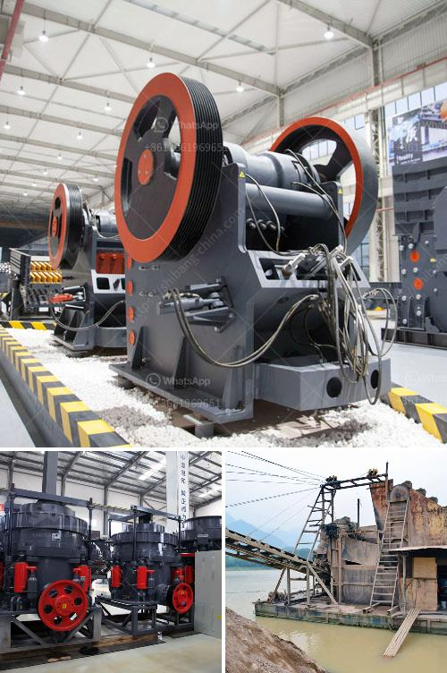

<h3>clay grinding machine for sale china</h3>
Clay grinding machine for sale in China - one of the most popular grinding machines in the mining industry, is the clay grinding machine. A clay grinding machine is a widely used grinding equipment, which is used in various industries including mining, construction, building materials, chemical, metallurgy, paint, and ceramics.

The demand for clay grinding machines in China is increasing due to the strong demand for clay-based materials such as bricks, tiles, and pottery. Chinese manufacturers are providing a variety of clay grinding machines for sale to cater to this growing demand.

One of the main benefits of using clay grinding machines is their ability to grind and process clay materials into fine powders. This allows manufacturers and craftsmen to create high-quality clay-based products with smooth and even surfaces. It also enhances the overall strength and durability of the final product.

The clay grinding machine consists of a grinding chamber, separator, blower, and air duct. The main component of the machine is the grinding chamber, which includes a grinding roller and grinding ring. The grinding roller rotates around the central axis of the grinding chamber, while the grinding ring remains stationary. This configuration creates a grinding force that crushes and grinds the clay materials.

The separator in the clay grinding machine separates the fine clay particles from the coarse ones. The fine particles are then collected and sent to the blower through the air duct, where they are further processed into the final product.

When looking for a clay grinding machine for sale in China, it is essential to consider various factors to ensure that the machine meets your specific requirements. These factors include the production capacity, particle size, power consumption, maintenance requirements, and cost.

The production capacity of the clay grinding machine determines the amount of clay material it can process within a given timeframe. Depending on your production needs, it is important to choose a machine that can handle the desired volume of clay material effectively.

The particle size of the final product is another crucial factor to consider when purchasing a clay grinding machine. Some machines are designed to produce fine powders, while others are more suitable for coarse grinding. It is critical to choose a machine that can achieve the desired particle size for your specific application.

Power consumption is another important consideration, as it directly affects the operational costs of the machine. Look for a machine that is energy efficient to minimize power consumption and reduce overall operating expenses.

Maintenance requirements should also be taken into account when choosing a clay grinding machine. It is advisable to select a machine that is easy to maintain and has readily available spare parts to ensure smooth and uninterrupted operation.

Finally, cost is a significant factor to consider when purchasing a clay grinding machine. Compare prices from different manufacturers and suppliers to find a machine that offers excellent value for money.

In conclusion, clay grinding machines are an essential tool for industries involved in clay-based products. With growing demand for clay materials, Chinese manufacturers are offering a variety of clay grinding machines for sale. When choosing a machine, consider factors such as production capacity, particle size, power consumption, maintenance requirements, and cost to ensure it meets your specific needs.
<h3>Contact us</h3><ul><li><strong>Whatsapp:&nbsp;<a href="https://wa.me/8613661969651">+8613661969651</a></strong></li><li><a href="https://swt.shibang-china.com/?git&amp;zhl&amp;clay grinding machine for sale china"><strong>Online Service(chat now)</strong></a></li></ul><h3>Related</h3><ul><li><a href='layoutde a crusher machine.md'>layoutde a crusher machine</a></li><li><a href='aggregate crushing plant layout.md'>aggregate crushing plant layout</a></li><li><a href='300tpd sponge iron machinery cost.md'>300tpd sponge iron machinery cost</a></li><li><a href='crusher dealers in kenya.md'>crusher dealers in kenya</a></li><li><a href='types of grinding mills.md'>types of grinding mills</a></li></ul>