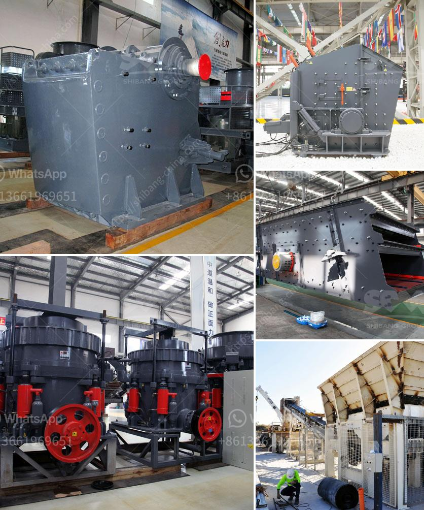

<h3>clay grinding machine</h3>
Clay is a naturally occurring raw material that is used in various industries for different purposes. In its natural form, clay is not suitable for use in industries such as ceramics, construction, and agriculture. It needs to go through a process called clay grinding to make it fine and powdered for further applications.

The clay grinding machine, also known as a clay mill, is specifically used for fine grinding of clay to achieve the desired particle size. Grinding clay involves the use of mechanical forces that break up the clay chunks into smaller pieces and reduce them to powder. This process is essential to ensure uniformity, smoothness, and fineness of clay particles.

One primary application of clay grinding machines is in the production of ceramics. Ceramics require clay in powdered form to enhance their plasticity and workability. The fine grinding process ensures that ceramics are made from evenly ground clay particles, resulting in the production of high-quality products.

The construction industry also relies heavily on clay grinding machines. Clay is a vital component in the manufacturing of bricks, tiles, and ceramic tiles. The grinding process ensures that clay particles are broken down to the desired size, allowing for better moldability and strength in construction materials.

Agriculture is another industry that benefits from clay grinding machines. Clay is used in agricultural applications such as soil conditioning, plant growth promotion, and as a carrier for fertilizers and pesticides. Grinding clay increases its surface area, making it more effective in soil conditioning and enhancing its ability to retain moisture and nutrients.

In conclusion, clay grinding machines play a crucial role in various industries, including ceramics, construction, and agriculture. They are essential in transforming raw clay into fine powder, providing improved plasticity, moldability, and strength to the final products. The use of clay grinding machines ensures the production of high-quality materials in these industries, resulting in better end products and increased productivity.
<h3>Contact us</h3><ul><li><strong>Whatsapp:&nbsp;<a href="https://wa.me/8613661969651">+8613661969651</a></strong></li><li><a href="https://swt.shibang-china.com/?git&amp;zhl&amp;clay grinding machine"><strong>Online Service(chat now)</strong></a></li></ul><h3>Related</h3><ul><li><a href='granite stone crusher india size.md'>granite stone crusher india size</a></li><li><a href='lime powder marking machines.md'>lime powder marking machines</a></li><li><a href='vibratory screen manufacturer.md'>vibratory screen manufacturer</a></li><li><a href='limestone grinding mill unit manufacturers.md'>limestone grinding mill unit manufacturers</a></li><li><a href='equipment to start up a quarry crusher.md'>equipment to start up a quarry crusher</a></li></ul>