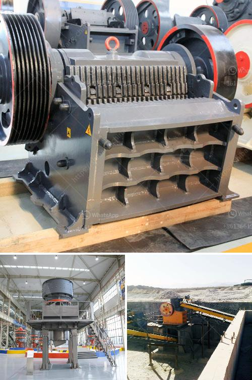

<h3>clay powder machine</h3>
In the world of ceramics, clay is the primary material used to create beautiful pottery and various types of ceramic products. While the process itself requires skill and craftsmanship, the efficiency of the production can be significantly improved with the use of a clay powder machine.

A clay powder machine, also known as a clay grinder, is a device that grinds the dried clay into fine particles. This machine not only enhances the quality of the end product but also reduces the time and effort required in the production process.

One of the main advantages of using a clay powder machine is its ability to provide a consistent and homogeneous mixture. Traditional methods of grinding clay involve manual labor, which can lead to uneven results. However, with the machine, the clay is pulverized into fine particles, ensuring uniformity in the material. This consistent mixture is crucial for producing ceramic products with desirable attributes such as strength and durability.

Moreover, a clay powder machine significantly reduces the processing time. In manual grinding, it can take hours or even days to achieve the desired particle size. This not only slows down the production but also poses challenges in terms of meeting deadlines and fulfilling orders. On the other hand, a clay powder machine can grind a large amount of clay within a short period, saving valuable time and increasing productivity.

Another advantage of using a clay powder machine is that it reduces the physical effort required in the grinding process. Manual grinding can be tiresome and strenuous, especially when dealing with large quantities of clay. This can lead to fatigue and decreased efficiency. Conversely, a clay powder machine operates mechanically, allowing operators to focus on other aspects of production, resulting in better workflow and overall productivity.

Furthermore, a clay powder machine contributes to a more sustainable and eco-friendly production process. Traditional grinding methods often involve the release of dust particles into the air, posing health risks to the workers and polluting the environment. The modern clay powder machine is equipped with advanced dust extraction systems, minimizing dust emissions and providing a cleaner working environment. Additionally, the machine consumes less energy compared to manual grinding, reducing the carbon footprint of the production process.

In conclusion, a clay powder machine is an indispensable tool in streamlining ceramic production. By providing a consistent mixture, reducing processing time, and decreasing physical effort, this machine significantly enhances efficiency in the production of ceramic products. Furthermore, it promotes sustainability by minimizing dust emissions and reducing energy consumption. Therefore, investing in a clay powder machine is a wise decision for any ceramic manufacturer looking to improve productivity and ensure the consistent quality of their products.
<h3>Contact us</h3><ul><li><strong>Whatsapp:&nbsp;<a href="https://wa.me/8613661969651">+8613661969651</a></strong></li><li><a href="https://swt.shibang-china.com/?git&amp;zhl&amp;clay powder machine"><strong>Online Service(chat now)</strong></a></li></ul><h3>Related</h3><ul><li><a href='layoutde a crusher machine.md'>layoutde a crusher machine</a></li><li><a href='mtw 175 tanzania mill output in 325 mesh.md'>mtw 175 tanzania mill output in 325 mesh</a></li><li><a href='stone grinding mills in pakistan.md'>stone grinding mills in pakistan</a></li><li><a href='india conveyor belt for stone crusher.md'>india conveyor belt for stone crusher</a></li><li><a href='vertical grinding machine defination.md'>vertical grinding machine defination</a></li></ul>