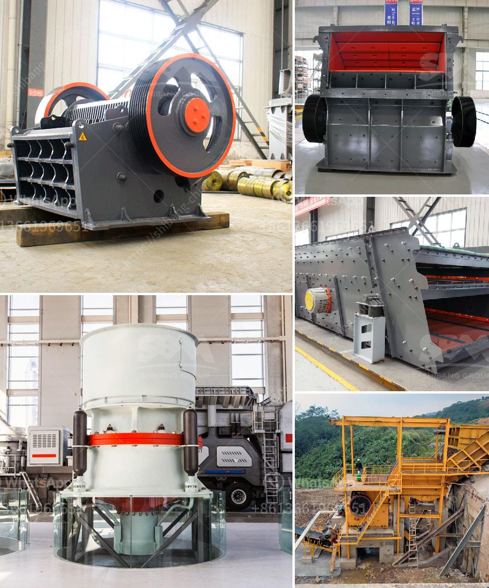

<h3>clinker grinding plant manufacturers germany</h3>
Clinker grinding plant refers to the grinding equipment used in the grinding process of clinker production. The grinding equipment is the most popular equipment in the market. Typically, the ball mill, vertical roller mill and trapezium mill can take the role of clinker grinding mill. Our cement grinding mill can make a big difference in your cement business.

In recent years, clinker grinding plant manufacturers Germany has developed its own unique advantages. In the market competition, the clinker grinding plant remains a prominent position. We provides high performanced clinker grinding plant that is ideal for the efficient grinding of the clinker to produce cement.

Our cement mill is the equipment used to grind the hard, nodular clinker from the cement kiln into the fine grey powder that is cement. Our cement ball mill, vertical roller mill, and trapezium mill, rotating mills, such as the cement mill and raw mill, are used to grind the clinker into proper fineness for producing cement.

Our clinker grinding plant is made available from 50 TPD to 1000 TPD on turnkey basis. We have carved a niche as one of the leading Portland cement clinker grinding plant manufacturers in Germany. Our cement clinker grinding plant is comprised of precrusher, feed hopper, table feeders, material handling equipment, ball mill, blending and packing plant. Our cement clinker grinding plant is available from 50tph to 1000tph on turnkey basis. We have been the leading clinker grinding plant provider in Germany.

If you need any help about clinker grinding plant manufacturers in Germany, you can chat with us online or leave us a message now. Our technicians are waiting for your help! We have been specialized in the cement industry for more than 30 years with the best quality, design and service, and the production capacity is up to 1000 TPH.

Our clinker grinding plant has been exported to many countries and areas. As for cement improvement, the application of cement vertical roller mill and clinker grinding mill is better and it has been widely used in cement production. We have made a breakthrough in the design and development of contemporary cement grinding technology, the construction of the industrial chain and the integration of the whole industry, providing technical support for the transformation and upgrading of cement enterprises, and striving to promote the development of cement grinding enterprise in Germany.

In conclusion, clinker grinding plant manufacturers Germany provides customers with high-quality clinker grinding equipment and pre-sales, in-sales and after-sales service. The clinker grinding equipment is miniaturized, environmentally friendly and energy-saving. We provide a complete set of construction waste crushing and treatment equipment for customers. When customers encounter problems, domestic and foreign customers can obtain our timely and effective services through our technical support and other means.
<h3>Contact us</h3><ul><li><strong>Whatsapp:&nbsp;<a href="https://wa.me/8613661969651">+8613661969651</a></strong></li><li><a href="https://swt.shibang-china.com/?git&amp;zhl&amp;clinker grinding plant manufacturers germany"><strong>Online Service(chat now)</strong></a></li></ul><h3>Related</h3><ul><li><a href='cost of dolomite milling machine in india.md'>cost of dolomite milling machine in india</a></li><li><a href='how to set up a quarry plant.md'>how to set up a quarry plant</a></li><li><a href='ball mill inside.md'>ball mill inside</a></li><li><a href='crushing machine manufacturer.md'>crushing machine manufacturer</a></li><li><a href='simple stone crusher dubai.md'>simple stone crusher dubai</a></li></ul>